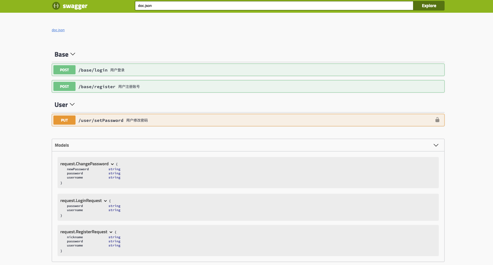
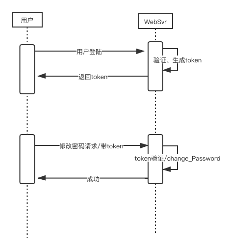

# gin jwt swagger example
`author: asong`
`time: 2020-08-02`
`公众号：Golang梦工厂`


|   版本  | 更新日期  |  更新内容 |
|  ----  | ----  | ---- |
| v1.0.0 | 2020.08.02 12:00| 增加版本说明、项目介绍、项目架构 |
| v1.0.1  | 2020.08.02 1:00| 增加mysql数据库设计 |
| v1.0.2 | 2020.08.09 19:00 | 增加使用说明、项目演示 |

## 版本说明
- golang: 1.14
- mysql: 5.7
- redis: 4.0.14
- swag：1.6.7
## 项目介绍

这个项目主要是为了方便大家学习gin框架、jwt、swagger（后续会添加其他模块，在此基础上添加），因此将其结合，完成用户登陆、修改操作,使用jwt进行鉴权，swagger生成接口文档。

## 项目演示
这里没有写前端，就不演示界面了，直接展示swagger生成的文档。直接可以进行接口测试。




## 使用说明
- 下载项目
```shell
$ git clone git@github.com:asong2020/Golang_Dream.git
```
将项目放到$GOPATH/src/asong.cloud/目录下。
- 下载相关依赖：
```shell
$ export GO111MODULE=on
$ go mod download
```
- 运行代码，进入到gin_jwt_swagger目录
```shell
$ go run main.go
```

## 项目架构
### 系统架构


### 功能说明


### 目录结构

```lua
gin_jwt_swagger
├── config -- 配置
├── dao -- db、cache操作方法
├── db -- sql文件
├── docs -- swagger 文档
├── global -- 全局变量声明
├── handler -- API处理
├── initserver  -- 初始化相关服务
├── middleware -- 中间件
├── model -- 模型文件
├── service -- 逻辑服务
├── static -- 静态文件
├── util -- 工具文件
├── config.yaml -- 配置文件
└── main.go -- 主函数
```

## 数据库设计

### mysql

#### 用户表结构设计(users)

```mysql
CREATE TABLE `users` (
  `id` bigint(20) NOT NULL,
  `username` varchar(64) NOT NULL,
  `nickname` varchar(255) DEFAULT NULL,
  `password` varchar(64) NOT NULL,
  `salt` varchar(64) NOT NULL,
  `avatar` varchar(128) NOT NULL,
  `uptime` datetime DEFAULT NULL,
  PRIMARY KEY (`id`),
  UNIQUE KEY `username` (`username`),
) ENGINE=InnoDB DEFAULT CHARSET=utf8;

```
|字段|类型|KEY|可否为空|注释|
|----|----|----|----|----|
|id|bigint(20)|PRI|not||
|username|varchar(64)|UNI|not|用户名|
|nickname|varchar(255)| |yes|昵称|
|password|varchar(64)| |not|密钥|
|salt|varchar(16)| |not|属性|
|avatar|varchar(128)| |yes|头像地址|
|uptime|datetime| |yes|更新信息时间|