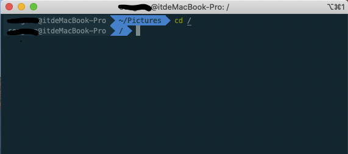
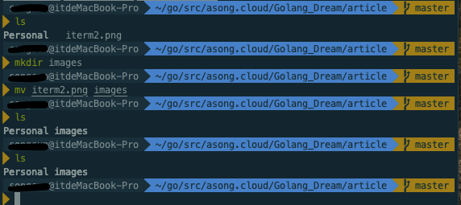
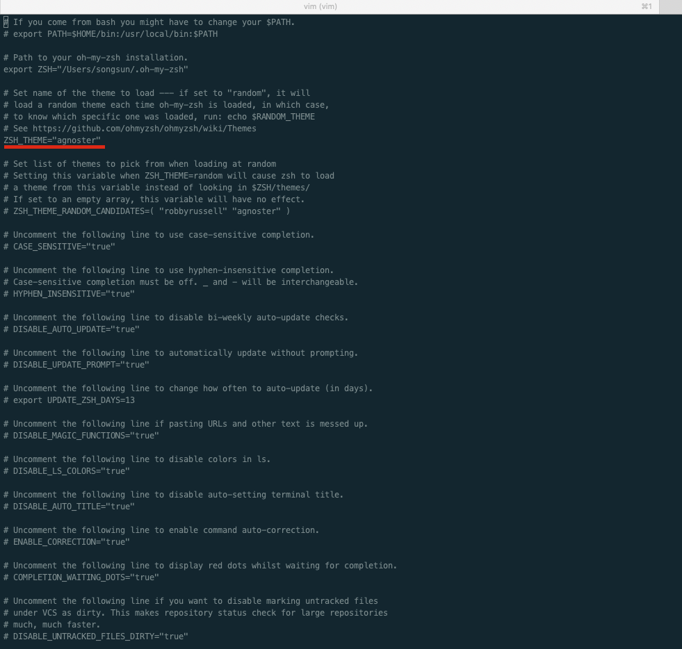
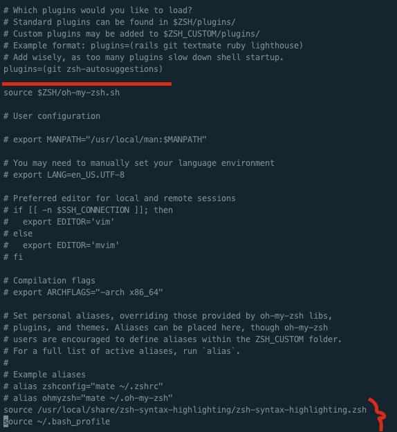

## 1. 前言

hello，我是asong，今天不做知识分享，给大家推荐一款mac终端利器iterm2。我们平常在做项目开发时，离不开使用终端，mac本身带的终端界面并不是特别的好看(手动狗头)，所以今天给大推荐这一款终端利器，不仅功能强大，而且看起来还顺眼，不说废话，直接展示。





怎么样，看起来还不错吧！！！ 下面就来教你们怎么安装。


## 2. iterm2安装


在mac下安装一些软件或者插件，我都喜欢使用brew命令进行安装，是真的方便。如果电脑没有安装brew，首先执行一下命令安装brew，在进行后续的操作。

```shell
/bin/bash -c "$(curl -fsSL https://raw.githubusercontent.com/Homebrew/install/master/install.sh)"
```

一条命令，直接安装成功。

接下来我们来安装iterm2：

```shell
brew cask install iterm2
```

安装成功后，我需要修改一下默认shell。Mac系统默认shell类型为bash类型，而iterm2则对应zsh类型。通过cat命令查看有哪些shell,然后进行切换。

```shell
cat /etc/shells
chsh -s /bin/zsh
```

这样我们就安装好了iterm2了，但是你会发现，这个界面跟我的怎么不一样，一点也不好看呀，不要慌，因为还要安装另一个插件，配合Oh My Zsh使用才会更好呦。


## 3. Oh My Zsh安装

执行以下命令：

```shell
sh -c "$(curl -fsSL https://raw.github.com/robbyrussell/oh-my-zsh/master/tools/install.sh)"
```

这样就安装好了，接下来我们就进行一些配置：

```shell
vim ~/.zshrc
```

执行以上命令，修改配置文件。



截图中红线处进行修改即可。我们还可以配置声明高亮的效果，不过需要先安装：

```shell
$ brew install zsh-syntax-highlighting
$ git clone https://github.com/zsh-users/zsh-autosuggestions ~/.oh-my-zsh/custom/plugins/zsh-autosuggestions
```

然后在配置文件中添加如下配置：



最后两行添加配置如下：

```shell
source /usr/local/share/zsh-syntax-highlighting/zsh-syntax-highlighting.zsh
source ~/.bash_profile
```

这样基本的配置就完成了。但是我们会发现一个问题，出现乱码的情况了，因为该主题不支持这个字体，所以需要下载该字体，进行配置。下载地址：[Meslo LG M Regular for Powerline.ttf](https://github.com/powerline/fonts/blob/master/Meslo%20Slashed/Meslo%20LG%20M%20Regular%20for%20Powerline.ttf)。可以到这个地址进行下载，我已经为你们下载好了，可以关注我的公众号：Golang梦工厂。后台回复：iterm2即可获取。

下载好，直接安装即可。打开iterm2终端，打开`preferences`界面，然后点击`Profiles -> Text -> Font -> Chanage Font`，选择 Meslo LG M Regular for Powerline 字体。重启iterm2，乱码解决了。


## 常用快捷键

```shell
新建标签：command + t

关闭标签：command + w

切换标签：command + 数字 command + 左右方向键

切换全屏：command + enter

查找：command + f

垂直分屏：command + d

水平分屏：command + shift + d

切换屏幕：command + option + 方向键 command + [ 或 command + ]

查看历史命令：command + ;

查看剪贴板历史：command + shift + h
清除当前行：ctrl + u

到行首：ctrl + a

到行尾：ctrl + e

前进后退：ctrl + f/b (相当于左右方向键)

上一条命令：ctrl + p

搜索命令历史：ctrl + r

删除当前光标的字符：ctrl + d

删除光标之前的字符：ctrl + h

删除光标之前的单词：ctrl + w

删除到文本末尾：ctrl + k

交换光标处文本：ctrl + t

清屏1：command + r

清屏2：ctrl + l

自带有哪些很实用的功能/快捷键

⌘ + 数字在各 tab 标签直接来回切换

选择即复制 + 鼠标中键粘贴，这个很实用

⌘ + f 所查找的内容会被自动复制

⌘ + d 横着分屏 / ⌘ + shift + d 竖着分屏

⌘ + r = clear，而且只是换到新一屏，不会想 clear 一样创建一个空屏

ctrl + u 清空当前行，无论光标在什么位置

输入开头命令后 按 ⌘ + ; 会自动列出输入过的命令

⌘ + shift + h 会列出剪切板历史

可以在 Preferences > keys 设置全局快捷键调出 iterm，这个也可以用过 Alfred 实现
```

暂时说这些，有需要的收藏，方便查找呦～～～


## 总结

好啦，到这里就安装好了，使用这样一款利器，开发是不是也变的更开心、方便了呢。

解锁更多玩法，可以去官网自行研究。传送门：[onmyzsh](https://github.com/ohmyzsh/ohmyzsh)、[iterm2](https://www.iterm2.com/)

欢迎关注公众号：Golang梦工厂，获取2020最新官方Gin中文文档，作者自己进行维护，定期更新，欢迎各位小伙伴提出宝贵意见，


