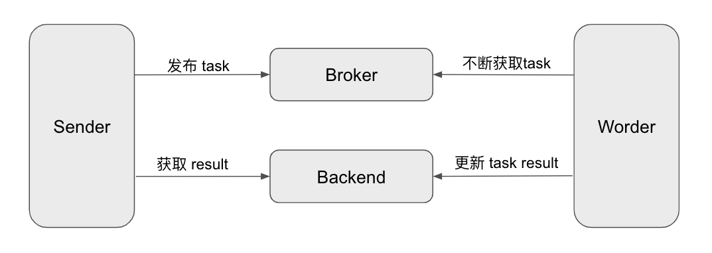
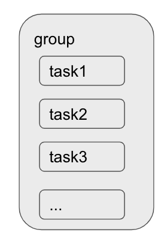
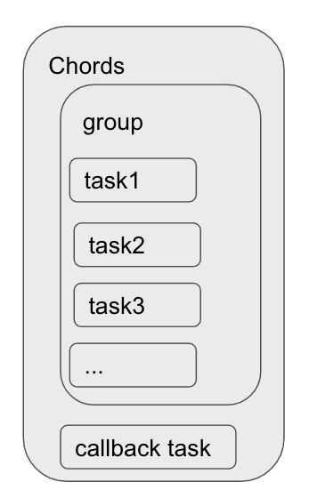
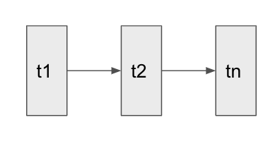

## 前言

>哈喽，大家好，我是asong，这次给大家介绍一个go的异步任务框架[machinery](https://github.com/RichardKnop/machinery)。使用过python的同学们都知道`Celery`框架，`machinery`框架就类似于`Celery`框架。下面我们就来学习一下`machinery`的基本使用。
>
>自己翻译一个粗略版的`machinery`中文文档，有需要的伙伴们公众号自取无水印版：后台回复：machinery即可领取。
>
>或者github下载：


## 抛砖引玉

我们在使用某些APP时，登陆系统后一般会收到一封邮件或者一个短信提示我们在某个时间某某地点登陆了。而邮件或短信都是在我们已经登陆后才收到，这里就是采用的异步机制。大家有没有想过这里为什么没有使用同步机制实现呢？我们来分析一下。假设我们现在采用同步的方式实现，用户在登录时，首先会去检验一下账号密码是否正确，验证通过后去给用户发送登陆提示信息，假如在这一步出错了，那么就会导致用户登陆失败，这样是大大影响用户的体验感的，一个登陆提示的优先级别并不是很高，所以我们完全可以采用异步的机制实现，即使失败了也不会影响用户的体验。前面说了这么多，那么异步机制该怎么实现呢？对，没错，就是`machinery`框架，听说你们还不会使用它，今天我就写一个小例子，我们一起来学习一下他吧。


## 特性

上面只是简单举了个例子，任务队列有着广泛的应用场景，比如大批量的计算任务，当有大量数据插入，通过拆分并分批插入任务队列，从而实现串行链式任务处理或者实现分组并行任务处理，提高系统鲁棒性，提高系统并发度；或者对数据进行预处理，定期的从后端存储将数据同步到到缓存系统，从而在查询请求发生时，直接去缓存系统中查询，提高查询请求的响应速度。适用任务队列的场景有很多，这里就不一一列举了。回归本文主题，既然我们要学习`machinery`，就要先了解一下他都有哪些特性呢？

- 任务重试机制
- 延迟任务支持
- 任务回调机制
- 任务结果记录
- 支持Workflow模式：Chain，Group，Chord
- 多Brokers支持：Redis, AMQP, [AWS SQS](https://aws.amazon.com/cn/sqs/)
- 多Backends支持：Redis, Memcache, AMQP, [MongoDB](https://cloud.tencent.com/product/mongodb?from=10680)


## 架构

任务队列，简而言之就是一个放大的生产者消费者模型，用户请求会生成任务，任务生产者不断的向队列中插入任务，同时，队列的处理器程序充当消费者不断的消费任务。基于这种框架设计思想，我们来看下machinery的简单设计结构图例：



- Sender：业务推送模块，生成具体任务，可根据业务逻辑中，按交互进行拆分；
- Broker：存储具体序列化后的任务，machinery中目前支持到Redis, AMQP,和SQS；
- Worker：工作进程，负责消费者功能，处理具体的任务；
- Backend：后端存储，用于存储任务执行状态的数据；


## e.g

学习一门新东西，我都习惯先写一个demo，先学会了走，再学会跑。所以先来看一个例子，功能很简单，异步计算1到10的和。

先看一下配置文件代码：

```go
broker: redis://localhost:6379

default_queue: "asong"

result_backend: redis://localhost:6379

redis:
  max_idle: 3
  max_active: 3
  max_idle_timeout: 240
  wait: true
  read_timeout: 15
  write_timeout: 15
  connect_timeout: 15
  normal_tasks_poll_period: 1000
  delayed_tasks_poll_period: 500
  delayed_tasks_key: "asong"
```

这里`broker`与`result_backend`来实现。

主代码，完整版github获取：

```go

func main()  {

	cnf,err := config.NewFromYaml("./config.yml",false)
	if err != nil{
		log.Println("config failed",err)
		return
	}

	server,err := machinery.NewServer(cnf)
	if err != nil{
		log.Println("start server failed",err)
		return
	}

	// 注册任务
	err = server.RegisterTask("sum",Sum)
	if err != nil{
		log.Println("reg task failed",err)
		return
	}

	worker := server.NewWorker("asong", 1)
	go func() {
		err = worker.Launch()
		if err != nil {
			log.Println("start worker error",err)
			return
		}
	}()

	//task signature
	signature := &tasks.Signature{
		Name: "sum",
		Args: []tasks.Arg{
			{
				Type:  "[]int64",
				Value: []int64{1,2,3,4,5,6,7,8,9,10},
			},
		},
	}

	asyncResult, err := server.SendTask(signature)
	if err != nil {
		log.Fatal(err)
	}
	res, err := asyncResult.Get(1)
	if err != nil {
		log.Fatal(err)
	}
	log.Printf("get res is %v\n", tasks.HumanReadableResults(res))

}
```

运行结果：

```go
INFO: 2020/10/31 11:32:15 file.go:19 Successfully loaded config from file ./config.yml
INFO: 2020/10/31 11:32:15 worker.go:58 Launching a worker with the following settings:
INFO: 2020/10/31 11:32:15 worker.go:59 - Broker: redis://localhost:6379
INFO: 2020/10/31 11:32:15 worker.go:61 - DefaultQueue: asong
INFO: 2020/10/31 11:32:15 worker.go:65 - ResultBackend: redis://localhost:6379
INFO: 2020/10/31 11:32:15 redis.go:100 [*] Waiting for messages. To exit press CTRL+C
DEBUG: 2020/10/31 11:32:16 redis.go:342 Received new message: {"UUID":"task_9f01be1f-3237-49f1-8464-eecca2e50597","Name":"sum","RoutingKey":"asong","ETA":null,"GroupUUID":"","GroupTaskCount":0,"Args":[{"Name":"","Type":"[]int64","Value":[1,2,3,4,5,6,7,8,9,10]}],"Headers":{},"Priority":0,"Immutable":false,"RetryCount":0,"RetryTimeout":0,"OnSuccess":null,"OnError":null,"ChordCallback":null,"BrokerMessageGroupId":"","SQSReceiptHandle":"","StopTaskDeletionOnError":false,"IgnoreWhenTaskNotRegistered":false}
DEBUG: 2020/10/31 11:32:16 worker.go:261 Processed task task_9f01be1f-3237-49f1-8464-eecca2e50597. Results = 55
2020/10/31 11:32:16 get res is 55
```

好啦，现在我们开始讲一讲上面的代码流程，

- 读取配置文件，这一步是为了配置`broker`和`result_backend`，这里我都选择的是`redis`，因为电脑正好有这个环境，就直接用了。
- `Machinery` 库必须在使用前实例化。实现方法是创建一个`Server`实例。`Server`是`Machinery`配置和注册任务的基本对象。
- 在你的`workders`能消费一个任务前，你需要将它注册到服务器。这是通过给任务分配一个唯一的名称来实现的。
- 为了消费任务，你需有有一个或多个worker正在运行。运行worker所需要的只是一个具有已注册任务的`Server`实例。每个worker将只使用已注册的任务。对于队列中的每个任务，Worker.Process()方法将在一个goroutine中运行。可以使用`server.NewWorker`的第二参数来限制并发运行的worker.Process()调用的数量(每个worker)。
- 可以通过将`Signature`实例传递给`Server`实例来调用任务。
- 调用`HumanReadableResults`这个方法可以处理反射值，获取到最终的结果。


## 	多功能

### 1. 延时任务

上面的代码只是一个简单`machinery`使用示例，其实`machiney`也支持延时任务的，可以通过在任务`signature`上设置ETA时间戳字段来延迟任务。

```go
eta := time.Now().UTC().Add(time.Second * 20)
	signature.ETA = &eta
```


### 2. 重试任务

在将任务声明为失败之前，可以设置多次重试尝试。斐波那契序列将用于在一段时间内分隔重试请求。这里可以使用两种方法，第一种直接对` tsak signature`中的`retryTimeout`和`RetryCount`字段进行设置，就可以，重试时间将按照斐波那契数列进行叠加。

```go
//task signature
	signature := &tasks.Signature{
		Name: "sum",
		Args: []tasks.Arg{
			{
				Type:  "[]int64",
				Value: []int64{1,2,3,4,5,6,7,8,9,10},
			},
		},
		RetryTimeout: 100,
		RetryCount: 3,
	}
```

或者，你可以使用`return.tasks.ErrRetryTaskLater` 返回任务并指定重试的持续时间。

```go
func Sum(args []int64) (int64, error) {
	sum := int64(0)
	for _, arg := range args {
		sum += arg
	}

	return sum, tasks.NewErrRetryTaskLater("我说他错了", 4 * time.Second)

}
```


### 3. 工作流

上面我们讲的都是运行一个异步任务，但是我们往往做项目时，一个需求是需要多个异步任务以编排好的方式执行的，所以我们就可以使用`machinery`的工作流来完成。


#### 3.1 Groups

`Group` 是一组任务，它们将相互独立地并行执行。还是画个图吧，这样看起来更明了：



一起来看一个简单的例子：

```go
	// group
	group,err :=tasks.NewGroup(signature1,signature2,signature3)
	if err != nil{
		log.Println("add group failed",err)
	}

	asyncResults, err :=server.SendGroupWithContext(context.Background(),group,10)
	if err != nil {
		log.Println(err)
	}
	for _, asyncResult := range asyncResults{
		results,err := asyncResult.Get(1)
		if err != nil{
			log.Println(err)
			continue
		}
		log.Printf(
			"%v  %v  %v\n",
			asyncResult.Signature.Args[0].Value,
			tasks.HumanReadableResults(results),
		)
	}
```

`group`中的任务是并行执行的。


#### 3.2 chods

我们在做项目时，往往会有一些回调场景，`machiney`也为我们考虑到了这一点，`Chord`允许你定一个回调任务在`groups`中的所有任务执行结束后被执行。



来看一段代码：

```go
callback := &tasks.Signature{
		Name: "call",
	}


	group, err := tasks.NewGroup(signature1, signature2, signature3)
	if err != nil {

		log.Printf("Error creating group: %s", err.Error())
		return
	}

	chord, err := tasks.NewChord(group, callback)
	if err != nil {
		log.Printf("Error creating chord: %s", err)
		return
	}

	chordAsyncResult, err := server.SendChordWithContext(context.Background(), chord, 0)
	if err != nil {
		log.Printf("Could not send chord: %s", err.Error())
		return
	}

	results, err := chordAsyncResult.Get(time.Duration(time.Millisecond * 5))
	if err != nil {
		log.Printf("Getting chord result failed with error: %s", err.Error())
		return
	}
	log.Printf("%v\n", tasks.HumanReadableResults(results))
```

上面的例子并行执行task1、task2、task3，聚合它们的结果并将它们传递给callback任务。


#### 3.3 chains

`chain`就是一个接一个执行的任务集，每个成功的任务都会触发`chain`中的下一个任务。



看这样一段代码：

```go
//chain
	chain,err := tasks.NewChain(signature1,signature2,signature3,callback)
	if err != nil {

		log.Printf("Error creating group: %s", err.Error())
		return
	}
	chainAsyncResult, err := server.SendChainWithContext(context.Background(), chain)
	if err != nil {
		log.Printf("Could not send chain: %s", err.Error())
		return
	}

	results, err := chainAsyncResult.Get(time.Duration(time.Millisecond * 5))
	if err != nil {
		log.Printf("Getting chain result failed with error: %s", err.Error())
	}
	log.Printf(" %v\n", tasks.HumanReadableResults(results))
```

上面的例子执行task1，然后是task2，然后是task3。当一个任务成功完成时，结果被附加到`chain`中下一个任务的参数列表的末尾，最终执行`callback`任务。


## 总结

这一篇文章到这里就结束了，`machinery`还有很多用法，比如定时任务、定时任务组等等，就不在这一篇文章介绍了。更多使用方法解锁可以观看`machinery`文档。因为`machiney`没有中文文档，所以我在学习的过程自己翻译了一篇中文文档，需要的小伙伴们自取。

获取步骤：关注公众号【Golang梦工厂】，后台回复：machiney即可获取无水印版～～～

好啦，这一篇文章到这就结束了，我们下期见～～。希望对你们有用，又不对的地方欢迎指出，可添加我的golang交流群，我们一起学习交流。

**结尾给大家发一个小福利吧，最近我在看[微服务架构设计模式]这一本书，讲的很好，自己也收集了一本PDF，有需要的小伙可以到自行下载。获取方式：关注公众号：[Golang梦工厂]，后台回复：[微服务]，即可获取。**

**我翻译了一份GIN中文文档，会定期进行维护，有需要的小伙伴后台回复[gin]即可下载。**

**我是asong，一名普普通通的程序猿，让我一起慢慢变强吧。我自己建了一个`golang`交流群，有需要的小伙伴加我`vx`,我拉你入群。欢迎各位的关注，我们下期见~~~**


推荐往期文章：

- [手把手教姐姐写消息队列](https://mp.weixin.qq.com/s/0MykGst1e2pgnXXUjojvhQ)
- [常见面试题之缓存雪崩、缓存穿透、缓存击穿](https://mp.weixin.qq.com/s?__biz=MzIzMDU0MTA3Nw==&mid=2247483988&idx=1&sn=3bd52650907867d65f1c4d5c3cff8f13&chksm=e8b0902edfc71938f7d7a29246d7278ac48e6c104ba27c684e12e840892252b0823de94b94c1&token=1558933779&lang=zh_CN#rd)
- [详解Context包，看这一篇就够了！！！](https://mp.weixin.qq.com/s/JKMHUpwXzLoSzWt_ElptFg)
- [go-ElasticSearch入门看这一篇就够了(一)](https://mp.weixin.qq.com/s/mV2hnfctQuRLRKpPPT9XRw)
- [面试官：go中for-range使用过吗？这几个问题你能解释一下原因吗](https://mp.weixin.qq.com/s/G7z80u83LTgLyfHgzgrd9g)
- [学会wire依赖注入、cron定时任务其实就这么简单！](https://mp.weixin.qq.com/s/qmbCmwZGmqKIZDlNs_a3Vw)
- [听说你还不会jwt和swagger-饭我都不吃了带着实践项目我就来了](https://mp.weixin.qq.com/s/z-PGZE84STccvfkf8ehTgA)
- [掌握这些Go语言特性，你的水平将提高N个档次(二)](https://mp.weixin.qq.com/s/7yyo83SzgQbEB7QWGY7k-w)
- [go实现多人聊天室，在这里你想聊什么都可以的啦！！！](https://mp.weixin.qq.com/s/H7F85CncQNdnPsjvGiemtg)
- [grpc实践-学会grpc就是这么简单](https://mp.weixin.qq.com/s/mOkihZEO7uwEAnnRKGdkLA)
- [go标准库rpc实践](https://mp.weixin.qq.com/s/d0xKVe_Cq1WsUGZxIlU8mw)
- [2020最新Gin框架中文文档 asong又捡起来了英语，用心翻译](https://mp.weixin.qq.com/s/vx8A6EEO2mgEMteUZNzkDg)
- [基于gin的几种热加载方式](https://mp.weixin.qq.com/s/CZvjXp3dimU-2hZlvsLfsw)