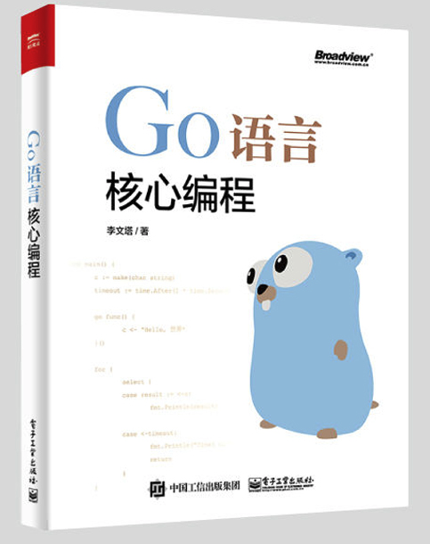
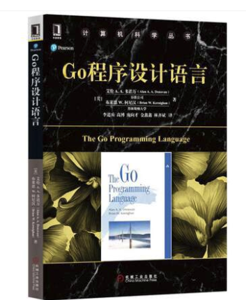
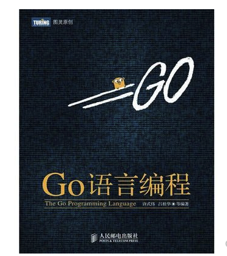
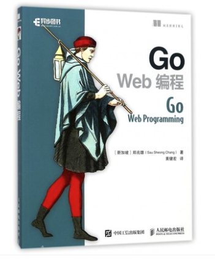
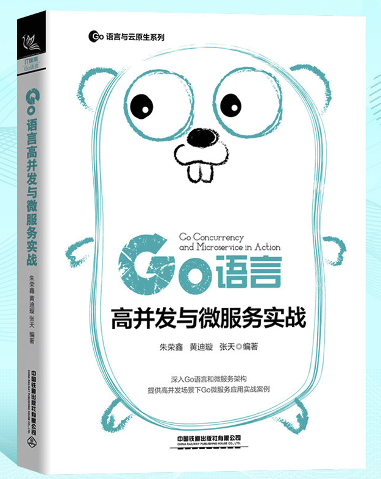
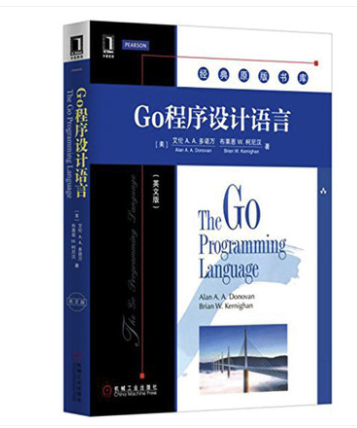

## 前言

> 最近总有读者问我可不可以推荐一下go语言入门必读书籍。所以今天就推荐几本。因为笔者也没读过几本，所以就咨询了几位前辈，现在我就把这一份书单介绍给你们，从入门到进阶。

## Go语言简介

> `Go`语言是最近几年流行起来的语言，该语言由谷歌发明，现在得到广泛应用。Go语言的最大特点就是语法简单且并发支持度好，开发效率很高。平常我们在C/C++语言中需要几十行的代码量，在`Go`语言中可能就只需要几行代码就可以搞定。现在也越来越多的人开始转学`Go`。

### Go语言优势

- 脚本化的语法；开发效率高，容易上手
- 静态类型+编译型，程序运行速度有保障；静态类型+编译型语言相对于动态类型+解释型语言的效率高
- 原生的支持并发编程；降低开发、维护成本/程序可以更好的执行
- 对于云原生支持比较好，容器化，微服务化比较容易。

### Go的缺点

- 它不支持泛型，即使有很多关于它的讨论。可能也在议程当中，期待那一天的到来。
- 使用这种编程语言分发的软件包非常有用，但Go在传统意义上并不是面向对象的。
- 缺少一些库，尤其是UI工具包。

### Go原生应用

- [Docker](https://github.com/docker/docker-ce)：一组用于部署Linux容器的工具
- [Openshift](https://github.com/openshift/origin)：由Red Hat提供的云计算平台即服务。
- [Kubernetes](https://github.com/kubernetes/kubernetes/)：无缝自动化部署流程的未来
- [Tidb](https://github.com/pingcap/tidb)： 开源分布式关系型数据库。
- [InfluxDB](https://github.com/influxdata/influxdb)：是由InfluxData开发的开源时间序列数据库。
- [Etcd](https://github.com/etcd-io/etcd)：分布式的键值对数据存储系统，提供共享配置、服务的注册和发现。

### 擅长领域

Go语言主要用途如下：

1. 服务器编程，如处理日志、数据打包、虚拟机处理、文件系统等
2. 分布式系统，数据库代理器等
3. 网络编程，如Web应用、API应用、下载应用
4. 内存数据库，如groupcache、couchbase的部分组建
5. 云平台，目前国外很多云平台在采用Go开发，CloudFoundy的部分组建，前VMare的技术总监自己出来搞的apcera云平台。

## 入门书籍

- Go语言核心编程

学习任何一门语言，首先要学习的就是语法，这一本书其实就完全可以带你入门，我读的第一本`Go`相关书籍就是它，对`Go`的基础语法、核心用都进行了详细讲解，尤其其中有几篇文章对`Go`语言陷阱进行讲解，真的很棒，强烈推荐。

- Go语言程序设计

这本书来头不小，其作者是`Kernigan`和谷歌公司`Go`团队主管`Alan Donovan`。这本书应该说是`Go`语言入门必读的第一本书。全书总共分为13章，主要内容包括：`Go`的基础知识、基本结构、基本数据类型、复合数据类型等等。这里就不全列举了。不过这本书我没有读过，所以给他放在了第二位。

- Go语言编程

这本书是国内某云的研发团队编写的。该公司是国内最早大规模使用`Go`的。这本强烈推荐给大家，这本书不仅介绍Go语言的关键语法，并且从工程实践的角度介绍`Go`语言的内容，从中一定会收获不少。

- Go并发编程实战

这本书讲解了`Go`语言的最大特点：并发编程。这本书对`Go`语言并发进行深入讲解，在你熟悉了`Go`语言基本语法后，强烈推荐大家看一下这本书，让你对并发的理解更上一个层次。

## 进阶书籍

- Go Web编程

这个是我读的第二本书，本书将教读者运用现代化设计理念构建Go Web应用的方法。阅读本书能让读者学会如何通过依赖注入设计模式来编写测试替身，如何在Web应用中使用并发特性，还有如何在Web服务中创建以及处理JSON数据和XML数据。除此之外，读者还将学会如何尽可能地减少应用对外部框架的依赖，并了解大量与应用测试以及应用部署有关的有价值的生产技术。

- Go语言编程之旅

这本书的作者是我们的煎鱼大佬，这本书是市面上少有的面向项目实践的一本书。这本书涵盖命令行应用、HTTP应用、RPC应用、WebSocket应用等常见项目，从做、学、排三个方向讲解，让我对项目实践有了更透彻的理解，特别是最后一章，排查和分析问题的总结，让我受益匪浅。

- Go语言高并发与微服务实战

本书以当前流行的微服务架构和`Go`语言的高并发特性为主线，介绍`Go`语言微服务的各个组件和并发实战。目前在市面上大部分微服务相关书籍中都是`JAVA`语言实现的，而本书则是基于`Go`语言来对微服务结构进行深入剖析，以大量实战总结和案例为主线怼微服务的相关技术做讲解。如果想系统学习微服务，这本书不容错过。

- Go语言圣经

很多大佬都推荐这一本书，但是我还是把它放在了最后，因为他真的不适合新手学习，里面的练习题真的难。所以一定要有一定经验了再去看这一本书，这本书确实是本好书，但不太适合非 C 系编程语言的人作为入门 Go 的首选。但是强烈推荐大家看一下这本书，不过不是刚入门的时候。

## 总结

上面这8本书，只是推荐阅读哈，并不是入门一定要看书哈，看视频也是一个不错的选择，B站入门视频就很多，可以白嫖～～～。

`Go语言圣经`强烈推荐看，兄弟们～～～。

**好啦，这一篇文章到这就结束了，我们下期见～～。希望对你们有用，又不对的地方欢迎指出，可添加我的golang交流群，我们一起学习交流。**

**结尾给大家发一个小福利吧，最近我在看[微服务架构设计模式]这一本书，讲的很好，自己也收集了一本PDF，有需要的小伙可以到自行下载。获取方式：关注公众号：[Golang梦工厂]，后台回复：[微服务]，即可获取。**

**我翻译了一份GIN中文文档，会定期进行维护，有需要的小伙伴后台回复[gin]即可下载。**

**翻译了一份Machinery中文文档，会定期进行维护，有需要的小伙伴们后台回复[machinery]即可获取。**

**我是asong，一名普普通通的程序猿，让gi我一起慢慢变强吧。我自己建了一个`golang`交流群，有需要的小伙伴加我`vx`,我拉你入群。欢迎各位的关注，我们下期见~~~**

推荐往期文章：

- [machinery-go异步任务队列](https://mp.weixin.qq.com/s/4QG69Qh1q7_i0lJdxKXWyg)
- [go参数传递类型](https://mp.weixin.qq.com/s/JHbFh2GhoKewlemq7iI59Q)
- [手把手教姐姐写消息队列](https://mp.weixin.qq.com/s/0MykGst1e2pgnXXUjojvhQ)
- [常见面试题之缓存雪崩、缓存穿透、缓存击穿](https://mp.weixin.qq.com/s?__biz=MzIzMDU0MTA3Nw==&mid=2247483988&idx=1&sn=3bd52650907867d65f1c4d5c3cff8f13&chksm=e8b0902edfc71938f7d7a29246d7278ac48e6c104ba27c684e12e840892252b0823de94b94c1&token=1558933779&lang=zh_CN#rd)
- [详解Context包，看这一篇就够了！！！](https://mp.weixin.qq.com/s/JKMHUpwXzLoSzWt_ElptFg)
- [go-ElasticSearch入门看这一篇就够了(一)](https://mp.weixin.qq.com/s/mV2hnfctQuRLRKpPPT9XRw)
- [面试官：go中for-range使用过吗？这几个问题你能解释一下原因吗](https://mp.weixin.qq.com/s/G7z80u83LTgLyfHgzgrd9g)