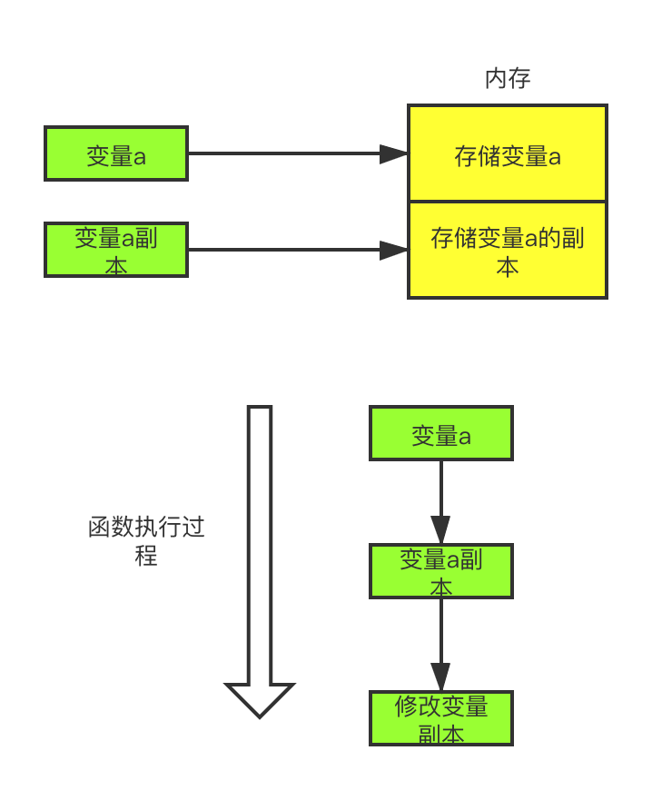
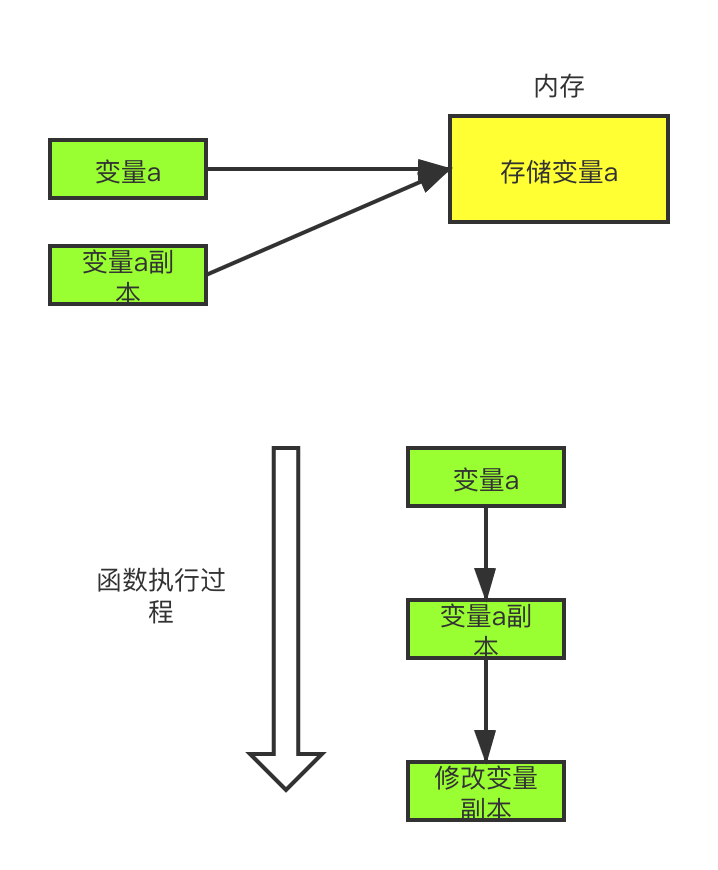
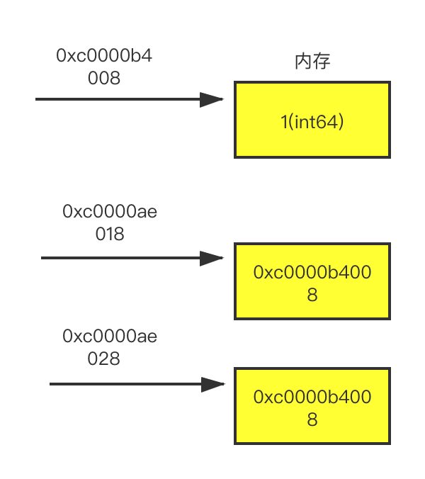

## 前言

> 哈喽，大家好，我是asong。今天女朋友问我，小松子，你知道Go语言参数传递是传值还是传引用吗？哎呀哈，我竟然被瞧不起了，我立马一顿操作，给他讲的明明白白的，小丫头片子，还是太嫩，大家且听我细细道来～～～。​


## 实参与形参数

我们使用`go`定义方法时是可以定义参数的。比如如下方法：

```go
func printNumber(args ...int)
```

这里的`args`就是参数。参数在程序语言中分为形式参数和实际参数。

形式参数：是在定义函数名和函数体的时候使用的参数,目的是用来接收调用该函数时传入的参数。

实际参数：在调用有参函数时，主调函数和被调函数之间有数据传递关系。在主调函数中调用一个函数时，函数名后面括号中的参数称为“实际参数”。

举例如下：

```go
func main()  {
 var args int64= 1
 printNumber(args)  // args就是实际参数
}

func printNumber(args ...int64)  { //这里定义的args就是形式参数
	for _,arg := range args{
		fmt.Println(arg) 
	}
}
```


## 什么是值传递

值传递，我们分析其字面意思：传递的就是值。传值的意思是：函数传递的总是原来这个东西的一个副本，一副拷贝。比如我们传递一个`int`类型的参数，传递的其实是这个参数的一个副本；传递一个指针类型的参数，其实传递的是这个该指针的一份拷贝，而不是这个指针指向的值。我们画个图来解释一下：



## 什么是引用传递

学习过其他语言的同学，对这个引用传递应该很熟悉，比如`C++`使用者，在C++中，函数参数的传递方式有引用传递。所谓**引用传递**是指在调用函数时将实际参数的地址传递到函数中，那么在函数中对参数所进行的修改，将影响到实际参数。



## golang是值传递

我们先写一个简单的例子验证一下：

```go
func main()  {
 var args int64= 1
 modifiedNumber(args) // args就是实际参数
 fmt.Printf("实际参数的地址 %p\n", &args)
 fmt.Printf("改动后的值是  %d\n",args)
}

func modifiedNumber(args int64)  { //这里定义的args就是形式参数
	fmt.Printf("形参地址 %p \n",&args)
	args = 10
}
```

运行结果：

```go
形参地址 0xc0000b4010 
实际参数的地址 0xc0000b4008
改动后的值是  1
```

这里正好验证了`go`是值传递，但是还不能完全确定`go`就只有值传递，我们在写一个例子验证一下：

```go
func main()  {
 var args int64= 1
 addr := &args
 fmt.Printf("原始指针的内存地址是 %p\n", addr)
 fmt.Printf("指针变量addr存放的地址 %p\n", &addr)
 modifiedNumber(addr) // args就是实际参数
 fmt.Printf("改动后的值是  %d\n",args)
}

func modifiedNumber(addr *int64)  { //这里定义的args就是形式参数
	fmt.Printf("形参地址 %p \n",&addr)
	*addr = 10
}
```

运行结果：

```go
原始指针的内存地址是 0xc0000b4008
指针变量addr存放的地址 0xc0000ae018
形参地址 0xc0000ae028 
改动后的值是  10
```

所以通过输出我们可以看到，这是一个指针的拷贝，因为存放这两个指针的内存地址是不同的，虽然指针的值相同，但是是两个不同的指针。



通过上面的图，我们可以更好的理解。我们声明了一个变量`args`，其值为`1`，并且他的内存存放地址是`0xc0000b4008`，通过这个地址，我们就可以找到变量`args`，这个地址也就是变量`args`的指针`addr`。指针`addr`也是一个指针类型的变量，它也需要内存存放它，它的内存地址是多少呢？是`0xc0000ae018`。 在我们传递指针变量`addr`给`modifiedNumber`函数的时候，是该指针变量的拷贝,所以新拷贝的指针变量`addr`，它的内存地址已经变了，是新的`0xc0000ae028`。所以，不管是`0xc0000ae018`还是`0xc0000ae028`，我们都可以称之为指针的指针，他们指向同一个指针`0xc0000b4008`，这个`0xc0000b4008`又指向变量`args`,这也就是为什么我们可以修改变量`args`的值。

通过上面的分析，我们就可以确定`go`就是值传递，因为我们在`modifieNumber`方法中打印出来的内存地址发生了改变，所以不是引用传递，实锤了奥兄弟们，证据确凿～～～。等等，好像好落下了点什么，说好的go中只有值传递呢，为什么`chan`、`map`、`slice`类型传递却可以改变其中的值呢？白着急，我们依次来验证一下。


### `slice`也是值传递吗？

先看一段代码：

```go
func main()  {
 var args =  []int64{1,2,3}
 fmt.Printf("切片args的地址： %p\n",args)
 modifiedNumber(args)
 fmt.Println(args)
}

func modifiedNumber(args []int64)  {
	fmt.Printf("形参切片的地址 %p \n",args)
	args[0] = 10
}
```

运行结果：

```go
切片args的地址： 0xc0000b8000
形参切片的地址 0xc0000b8000 
[10 2 3]
```

哇去，怎么回事，光速打脸呢，这怎么地址都是一样的呢？并且值还被修改了呢？怎么回事，作何解释，你个渣男，欺骗我感情。。。不好意思走错片场了。继续来看这个问题。这里我们没有使用`&`符号取地址符转换，就把`slice`地址打印出来了，我们在加上一行代码测试一下：

```go
func main()  {
 var args =  []int64{1,2,3}
 fmt.Printf("切片args的地址： %p \n",args)
 fmt.Printf("切片args第一个元素的地址： %p \n",&args[0])
 fmt.Printf("直接对切片args取地址%v \n",&args)
 modifiedNumber(args)
 fmt.Println(args)
}

func modifiedNumber(args []int64)  {
	fmt.Printf("形参切片的地址 %p \n",args)
	fmt.Printf("形参切片args第一个元素的地址： %p \n",&args[0])
	fmt.Printf("直接对形参切片args取地址%v \n",&args)
	args[0] = 10
}
```

运行结果：

```go
切片args的地址： 0xc000016140 
切片args第一个元素的地址： 0xc000016140 
直接对切片args取地址&[1 2 3] 
形参切片的地址 0xc000016140 
形参切片args第一个元素的地址： 0xc000016140 
直接对形参切片args取地址&[1 2 3] 
[10 2 3]
```

通过这个例子我们可以看到，使用&操作符表示slice的地址是无效的，而且使用%p输出的内存地址与slice的第一个元素的地址是一样的，那么为什么会出现这样的情况呢？会不会是`fmt.Printf`函数做了什么特殊处理？我们来看一下其源码：

```go
fmt包,print.go中的printValue这个方法,截取重点部分，因为`slice`也是引用类型，所以会进入这个`case`：
case reflect.Ptr:
		// pointer to array or slice or struct? ok at top level
		// but not embedded (avoid loops)
		if depth == 0 && f.Pointer() != 0 {
			switch a := f.Elem(); a.Kind() {
			case reflect.Array, reflect.Slice, reflect.Struct, reflect.Map:
				p.buf.writeByte('&')
				p.printValue(a, verb, depth+1)
				return
			}
		}
		fallthrough
	case reflect.Chan, reflect.Func, reflect.UnsafePointer:
		p.fmtPointer(f, verb)
```

`p.buf.writeByte('&')`这行代码就是为什么我们使用`&`打印地址输出结果前面带有`&`的语音。因为我们要打印的是一个`slice`类型，就会调用`p.printValue(a, verb, depth+1)`递归获取切片中的内容，为什么打印出来的切片中还会有`[]`包围呢，我来看一下`printValue`这个方法的源代码：

```go
case reflect.Array, reflect.Slice:
//省略部分代码
} else {
			p.buf.writeByte('[')
			for i := 0; i < f.Len(); i++ {
				if i > 0 {
					p.buf.writeByte(' ')
				}
				p.printValue(f.Index(i), verb, depth+1)
			}
			p.buf.writeByte(']')
		}
```

这就是上面` fmt.Printf("直接对切片args取地址%v \n",&args)`输出`直接对切片args取地址&[1 2 3] `的原因。这个问题解决了，我们再来看一看使用%p输出的内存地址与slice的第一个元素的地址是一样的。在上面的源码中，有这样一行代码`fallthrough`，代表着接下来的`fmt.Poniter`也会被执行，我看一下其源码：

```go
func (p *pp) fmtPointer(value reflect.Value, verb rune) {
	var u uintptr
	switch value.Kind() {
	case reflect.Chan, reflect.Func, reflect.Map, reflect.Ptr, reflect.Slice, reflect.UnsafePointer:
		u = value.Pointer()
	default:
		p.badVerb(verb)
		return
	}
...... 省略部分代码
// If v's Kind is Slice, the returned pointer is to the first
// element of the slice. If the slice is nil the returned value
// is 0.  If the slice is empty but non-nil the return value is non-zero.
 func (v Value) Pointer() uintptr {
	// TODO: deprecate
	k := v.kind()
	switch k {
	case Chan, Map, Ptr, UnsafePointer:
		return uintptr(v.pointer())
	case Func:
		if v.flag&flagMethod != 0 {
 ....... 省略部分代码
```

这里我们可以看到上面有这样一句注释：If v's Kind is Slice, the returned pointer is to the first。翻译成中文就是如果是`slice`类型，返回`slice`这个结构里的第一个元素的地址。这里正好解释上面为什么`fmt.Printf("切片args的地址： %p \n",args)`和`fmt.Printf("形参切片的地址 %p \n",args)`打印出来的地址是一样的，因为`args`是引用类型，所以他们都返回`slice`这个结构里的第一个元素的地址，为什么这两个`slice`结构里的第一个元素的地址一样呢，这就要在说一说`slice`的底层结构了。

我们看一下`slice`底层结构：

```go
//runtime/slice.go
type slice struct {
	array unsafe.Pointer
	len   int
	cap   int
}
```

`slice`是一个结构体，他的第一个元素是一个指针类型，这个指针指向的是底层数组的第一个元素。所以当是`slice`类型的时候，`fmt.Printf`返回是`slice`这个结构体里第一个元素的地址。说到底，又转变成了指针处理，只不过这个指针是`slice`中第一个元素的内存地址。

说了这么多，最后再做一个总结吧，为什么`slice`也是值传递。之所以对于引用类型的传递可以修改原内容的数据，这是因为在底层默认使用该引用类型的指针进行传递，但也是使用指针的副本，依旧是值传递。所以`slice`传递的就是第一个元素的指针的副本，因为`fmt.printf`缘故造成了打印的地址一样，给人一种混淆的感觉。


### map也是值传递吗？

`map`和`slice`一样都具有迷惑行为，哼，渣女。`map`我们可以通过方法修改它的内容，并且它没有明显的指针。比如这个例子：

```go
func main()  {
	persons:=make(map[string]int)
	persons["asong"]=8

	addr:=&persons

	fmt.Printf("原始map的内存地址是：%p\n",addr)
	modifiedAge(persons)
	fmt.Println("map值被修改了，新值为:",persons)
}

func modifiedAge(person map[string]int)  {
	fmt.Printf("函数里接收到map的内存地址是：%p\n",&person)
	person["asong"]=9
}
```

看一眼运行结果：

```go
原始map的内存地址是：0xc00000e028
函数里接收到map的内存地址是：0xc00000e038
map值被修改了，新值为: map[asong:9]
```

先喵一眼，哎呀，实参与形参地址不一样，应该是值传递无疑了，等等。。。。`map`值怎么被修改了？一脸疑惑。。。。。

为了解决我们的疑惑，我们从源码入手，看一看什么原理：

```go
//src/runtime/map.go
// makemap implements Go map creation for make(map[k]v, hint).
// If the compiler has determined that the map or the first bucket
// can be created on the stack, h and/or bucket may be non-nil.
// If h != nil, the map can be created directly in h.
// If h.buckets != nil, bucket pointed to can be used as the first bucket.
func makemap(t *maptype, hint int, h *hmap) *hmap {
	mem, overflow := math.MulUintptr(uintptr(hint), t.bucket.size)
	if overflow || mem > maxAlloc {
		hint = 0
	}

	// initialize Hmap
	if h == nil {
		h = new(hmap)
	}
	h.hash0 = fastrand()
```

从以上源码，我们可以看出，使用`make`函数返回的是一个`hmap`类型的指针`*hmap`。回到上面那个例子，我们的`func modifiedAge(person map[string]int)`函数，其实就等于`func modifiedAge(person *hmap）`,实际上在作为传递参数时还是使用了指针的副本进行传递，属于值传递。在这里，Go语言通过`make`函数，字面量的包装，为我们省去了指针的操作，让我们可以更容易的使用map。这里的`map`可以理解为引用类型，但是记住引用类型不是传引用。


### chan是值传递吗？

老样子，先看一个例子：

```go
func main()  {
	p:=make(chan bool)
	fmt.Printf("原始chan的内存地址是：%p\n",&p)
	go func(p chan bool){
		fmt.Printf("函数里接收到chan的内存地址是：%p\n",&p)
		//模拟耗时
		time.Sleep(2*time.Second)
		p<-true
	}(p)

	select {
	case l := <- p:
		fmt.Println(l)
	}
}
```

再看一看运行结果：

```go
原始chan的内存地址是：0xc00000e028
函数里接收到chan的内存地址是：0xc00000e038
true
```

这个怎么回事，实参与形参地址不一样，但是这个值是怎么传回来的，说好的值传递呢？白着急，铁子，我们像分析`map`那样，再来分析一下`chan`。首先看源码：

```go
// src/runtime/chan.go
func makechan(t *chantype, size int) *hchan {
	elem := t.elem

	// compiler checks this but be safe.
	if elem.size >= 1<<16 {
		throw("makechan: invalid channel element type")
	}
	if hchanSize%maxAlign != 0 || elem.align > maxAlign {
		throw("makechan: bad alignment")
	}

	mem, overflow := math.MulUintptr(elem.size, uintptr(size))
	if overflow || mem > maxAlloc-hchanSize || size < 0 {
		panic(plainError("makechan: size out of range"))
	}

```

从以上源码，我们可以看出，使用`make`函数返回的是一个`hchan`类型的指针`*hchan`。这不是与`map`一个道理嘛，再次回到上面的例子，实际我们的`fun (p chan bool)`与`fun (p *hchan)`是一样的，实际上在作为传递参数时还是使用了指针的副本进行传递，属于值传递。

是不是到这里，基本就可以确定`go`就是值传递了呢？还剩最后一个没有测试，那就是`struct`，我们最后来验证一下`struct`。


### `struct`就是值传递

没错，我先说答案，`struct`就是值传递，不信你看这个例子：

```go
func main()  {
	per := Person{
		Name: "asong",
		Age: int64(8),
	}
	fmt.Printf("原始struct地址是：%p\n",&per)
	modifiedAge(per)
	fmt.Println(per)
}

func modifiedAge(per Person)  {
	fmt.Printf("函数里接收到struct的内存地址是：%p\n",&per)
	per.Age = 10
}
```

我们发现，我们自己定义的`Person`类型，在函数传参的时候也是值传递，但是它的值(`Age`字段)并没有被修改，我们想改成`10`，发现最后的结果还是`8`。


## 前文总结

**兄弟们实锤了奥，go就是值传递，可以确认的是Go语言中所有的传参都是值传递（传值），都是一个副本，一个拷贝。因为拷贝的内容有时候是非引用类型（int、string、struct等这些），这样就在函数中就无法修改原内容数据；有的是引用类型（指针、map、slice、chan等这些），这样就可以修改原内容数据。**

**是否可以修改原内容数据，和传值、传引用没有必然的关系。在C++中，传引用肯定是可以修改原内容数据的，在Go语言里，虽然只有传值，但是我们也可以修改原内容数据，因为参数是引用类型。**

**有的小伙伴会在这里还是懵逼，因为你把引用类型和传引用当成一个概念了，这是两个概念，切记！！！**


### 出个题考验你们一下

**欢迎在评论区留下你的答案～～～**


既然你们都知道了golang只有值传递，那么这段代码来帮我分析一下吧，这里的值能修改成功，为什么使用append不会发生扩容？

```go
func main() {
	array := []int{7,8,9}
	fmt.Printf("main ap brfore: len: %d cap:%d data:%+v\n", len(array), cap(array), array)
	ap(array)
	fmt.Printf("main ap after: len: %d cap:%d data:%+v\n", len(array), cap(array), array)
}

func ap(array []int) {
	fmt.Printf("ap brfore:  len: %d cap:%d data:%+v\n", len(array), cap(array), array)
  array[0] = 1
	array = append(array, 10)
	fmt.Printf("ap after:   len: %d cap:%d data:%+v\n", len(array), cap(array), array)
}

```


## 后记

**好啦，这一篇文章到这就结束了，我们下期见～～。希望对你们有用，又不对的地方欢迎指出，可添加我的golang交流群，我们一起学习交流。**

**结尾给大家发一个小福利吧，最近我在看[微服务架构设计模式]这一本书，讲的很好，自己也收集了一本PDF，有需要的小伙可以到自行下载。获取方式：关注公众号：[Golang梦工厂]，后台回复：[微服务]，即可获取。**

**我翻译了一份GIN中文文档，会定期进行维护，有需要的小伙伴后台回复[gin]即可下载。**

**翻译了一份Machinery中文文档，会定期进行维护，有需要的小伙伴们后台回复[machinery]即可获取。**

**我是asong，一名普普通通的程序猿，让gi我一起慢慢变强吧。我自己建了一个`golang`交流群，有需要的小伙伴加我`vx`,我拉你入群。欢迎各位的关注，我们下期见~~~**


推荐往期文章：

- [machinery-go异步任务队列](https://mp.weixin.qq.com/s/4QG69Qh1q7_i0lJdxKXWyg)
- [go参数传递类型](https://mp.weixin.qq.com/s/JHbFh2GhoKewlemq7iI59Q)
- [手把手教姐姐写消息队列](https://mp.weixin.qq.com/s/0MykGst1e2pgnXXUjojvhQ)
- [常见面试题之缓存雪崩、缓存穿透、缓存击穿](https://mp.weixin.qq.com/s?__biz=MzIzMDU0MTA3Nw==&mid=2247483988&idx=1&sn=3bd52650907867d65f1c4d5c3cff8f13&chksm=e8b0902edfc71938f7d7a29246d7278ac48e6c104ba27c684e12e840892252b0823de94b94c1&token=1558933779&lang=zh_CN#rd)
- [详解Context包，看这一篇就够了！！！](https://mp.weixin.qq.com/s/JKMHUpwXzLoSzWt_ElptFg)
- [go-ElasticSearch入门看这一篇就够了(一)](https://mp.weixin.qq.com/s/mV2hnfctQuRLRKpPPT9XRw)
- [面试官：go中for-range使用过吗？这几个问题你能解释一下原因吗](https://mp.weixin.qq.com/s/G7z80u83LTgLyfHgzgrd9g)
- [学会wire依赖注入、cron定时任务其实就这么简单！](https://mp.weixin.qq.com/s/qmbCmwZGmqKIZDlNs_a3Vw)
- [听说你还不会jwt和swagger-饭我都不吃了带着实践项目我就来了](https://mp.weixin.qq.com/s/z-PGZE84STccvfkf8ehTgA)
- [掌握这些Go语言特性，你的水平将提高N个档次(二)](https://mp.weixin.qq.com/s/7yyo83SzgQbEB7QWGY7k-w)