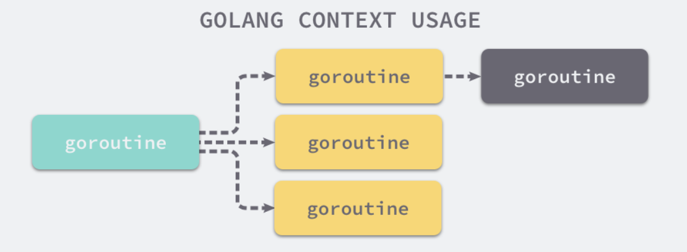
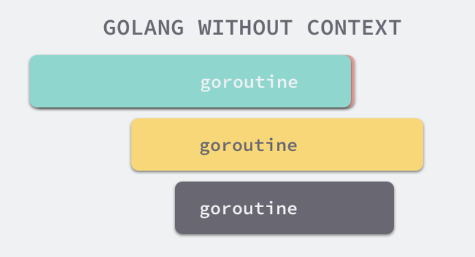
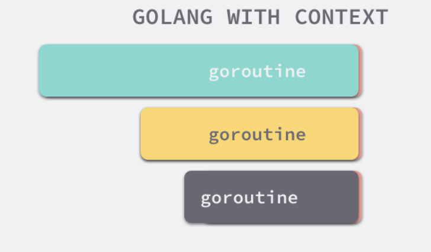

## 前言

> 最近在项目开发时，经常使用到`Context`这个包。`context.Context`是Go语言中独特的设计，在其他编程语言中我们很少见到类似的概念。所以这一期我们就来好好讲一讲`Context`的基本概念与实际使用，麻麻再也不担心我的并发编程啦～～～。


## 什么是context

在理解`context`包之前，我们应该熟悉两个概念，因为这能加深你对`context`的理解。

### 1. Goroutine

`Goroutine`是一个轻量级的执行线程，多个`Goroutine`比一个线程轻量所以管理他们消耗的资源相对更少。`Goroutine`是Go中最基本的执行单元，每一个Go程序至少有一个`Goroutine`：主`Goroutine`。程序启动时会自动创建。这里为了大家能更好的理解`Goroutine`，我们先来看一看线程与协程的概念。

- 线程（Thread）

线程是一种轻量级进程，是CPU调度的最小单位。一个标准的线程由线程ID，当前指令指针（PC），寄存器集合和堆栈组成。线程是进程中的一个实体，是被系统独立调度和分派的基本单位，线程自己不拥有系统资源，只拥有一点在运行中必不可少的资源，但它可与同属于一个进程的其他线程共享进程所拥有的全部资源。线程拥有自己独立的栈和共享的堆，共享堆，不共享栈，线程的切换一般也由操作系统调度。

- 协程（coroutine）

又称为微线程与子例程一样，协程也是一种程序组建，相对子例程而言，协程更为灵活，但在实践中使用没有子例程那样广泛。和线程类似，共享堆，不共享栈，协程的切换一般由程序员在代码中显式控制。他避免了上下文切换的额外耗费，兼顾了多线程的优点，简化了高并发程序的复杂。

Goroutine和其他语言的协程（coroutine）在使用方式上类似，但从字面意义上来看不同（一个是Goroutine，一个是coroutine），再就是协程是一种协作任务控制机制，在最简单的意义上，协程不是并发的，而Goroutine支持并发的。因此Goroutine可以理解为一种Go语言的协程。同时它可以运行在一个或多个线程上。

我们来看一个简单示例：

```go
func Hello()  {
	fmt.Println("hello everybody , I'm asong")
}

func main()  {
	go Hello()
	fmt.Println("Golang梦工厂")
}
```

上面的程序，我们使用go又开启了一个`Goroutine`执行`Hello`方法，但是我们运行这个程序，运行结果如下:

```
Golang梦工厂
```

这里出现这个问题的原因是我们启动的`goroutine`在`main`执行完就退出了，所以为了`main`等待这个`Goroutine`执行完，我们就需要一些方法，让`goroutine`告诉`main`执行完了，这里就需要通道了。


### 2. 通道

这是 goroutine 之间的沟通渠道。当您想要将结果或错误，或任何其他类型的信息从一个 goroutine 传递到另一个 goroutine 时就可以使用通道。通道是有类型的，可以是 int 类型的通道接收整数或错误类型的接收错误等。

假设有个 int 类型的通道 ch，如果你想发一些信息到这个通道，语法是 ch <- 1，如果你想从这个通道接收一些信息，语法就是 var := <-ch。这将从这个通道接收并存储值到 var 变量。

以下程序说明了通道的使用确保了 goroutine 执行完成并将值返回给 main 。

```go
func Hello(ch chan int)  {
	fmt.Println("hello everybody , I'm asong")
	ch <- 1
}

func main()  {
	ch := make(chan int)
	go Hello(ch)
	<-ch
	fmt.Println("Golang梦工厂")
}
```

这里我们使用通道进行等待，这样`main`就会等待`goroutine`执行完。现在我们知道了`goroutine`、`channel`的概念了，下面我们就来介绍一下`context`。


## 3. 场景

有了上面的概念，我们在来看一个例子：

如下代码，每次请求，Handler会创建一个goroutine来为其提供服务，而且连续请求3次，`request`的地址也是不同的：

```go
func main()  {
	http.HandleFunc("/", SayHello) // 设置访问的路由

	log.Fatalln(http.ListenAndServe(":8080",nil))
}

func SayHello(writer http.ResponseWriter, request *http.Request)  {
	fmt.Println(&request)
	writer.Write([]byte("Hi"))
}

========================================================
$ curl http://localhost:8080/
0xc0000b8030
0xc000186008
0xc000186018
```

而每个请求对应的Handler，常会启动额外的的goroutine进行数据查询或PRC调用等。

而当请求返回时，这些额外创建的goroutine需要及时回收。而且，一个请求对应一组请求域内的数据可能会被该请求调用链条内的各goroutine所需要。

现在我们对上面代码在添加一点东西，当请求进来时，`Handler`创建一个监控`goroutine`，这样就会每隔1s打印一句`Current request is in progress `

```go
func main()  {
	http.HandleFunc("/", SayHello) // 设置访问的路由

	log.Fatalln(http.ListenAndServe(":8080",nil))
}

func SayHello(writer http.ResponseWriter, request *http.Request)  {
	fmt.Println(&request)

	go func() {
		for range time.Tick(time.Second) {
			fmt.Println("Current request is in progress")
		}
	}()

	time.Sleep(2 * time.Second)
	writer.Write([]byte("Hi"))
}
```

这里我假定请求需要耗时2s，在请求2s后返回，我们期望监控goroutine在打印2次`Current request is in progress`后即停止。但运行发现，监控goroutine打印2次后，其仍不会结束，而会一直打印下去。

问题出在创建监控goroutine后，未对其生命周期作控制，下面我们使用context作一下控制，即监控程序打印前需检测`request.Context()`是否已经结束，若结束则退出循环，即结束生命周期。

```go
func main()  {
	http.HandleFunc("/", SayHello) // 设置访问的路由

	log.Fatalln(http.ListenAndServe(":8080",nil))
}

func SayHello(writer http.ResponseWriter, request *http.Request)  {
	fmt.Println(&request)

	go func() {
		for range time.Tick(time.Second) {
			select {
			case <- request.Context().Done():
				fmt.Println("request is outgoing")
				return
			default:
				fmt.Println("Current request is in progress")
			}
		}
	}()

	time.Sleep(2 * time.Second)
	writer.Write([]byte("Hi"))
}
```

基于如上需求，context包应用而生。context包可以提供一个请求从API请求边界到各goroutine的请求域数据传递、取消信号及截至时间等能力。详细原理请看下文。


## 4. context

在 Go 语言中 context 包允许您传递一个 "context" 到您的程序。 Context 如超时或截止日期（deadline）或通道，来指示停止运行和返回。例如，如果您正在执行一个 web 请求或运行一个系统命令，定义一个超时对生产级系统通常是个好主意。因为，如果您依赖的API运行缓慢，你不希望在系统上备份（back up）请求，因为它可能最终会增加负载并降低所有请求的执行效率。导致级联效应。这是超时或截止日期 context 派上用场的地方。

#### 4.1 设计原理

Go 语言中的每一个请求的都是通过一个单独的 Goroutine 进行处理的，HTTP/RPC 请求的处理器往往都会启动新的 Goroutine 访问数据库和 RPC 服务，我们可能会创建多个 Goroutine 来处理一次请求，而 `Context` 的主要作用就是在不同的 Goroutine 之间同步请求特定的数据、取消信号以及处理请求的截止日期。



每一个 `Context` 都会从最顶层的 Goroutine 一层一层传递到最下层，这也是 Golang 中上下文最常见的使用方式，如果没有 `Context`，当上层执行的操作出现错误时，下层其实不会收到错误而是会继续执行下去。



当最上层的 Goroutine 因为某些原因执行失败时，下两层的 Goroutine 由于没有接收到这个信号所以会继续工作；但是当我们正确地使用 `Context` 时，就可以在下层及时停掉无用的工作减少额外资源的消耗：



这其实就是 Golang 中上下文的最大作用，在不同 Goroutine 之间对信号进行同步避免对计算资源的浪费，与此同时 `Context` 还能携带以请求为作用域的键值对信息。

这里光说，其实也不能完全理解其中的作用，所以我们来看一个例子：

```go
func main()  {
	ctx,cancel := context.WithTimeout(context.Background(),1 * time.Second)
	defer cancel()
	go HelloHandle(ctx,500*time.Millisecond)
	select {
	case <- ctx.Done():
		fmt.Println("Hello Handle ",ctx.Err())
	}
}

func HelloHandle(ctx context.Context,duration time.Duration)  {

	select {
	case <-ctx.Done():
		fmt.Println(ctx.Err())
	case <-time.After(duration):
		fmt.Println("process request with", duration)
	}

}
```

上面的代码，因为过期时间大于处理时间，所以我们有足够的时间处理改请求，所以运行代码如下图所示：

```go
process request with 500ms
Hello Handle  context deadline exceeded
```

`HelloHandle`函数并没有进入超时的`select`分支，但是`main`函数的`select`却会等待`context.Context`的超时并打印出`Hello Handle  context deadline exceeded`。如果我们将处理请求的时间增加至`2000`ms，程序就会因为上下文过期而被终止。

```go
context deadline exceeded
Hello Handle  context deadline exceeded
```


#### 4.2 接口

[`context.Context`](https://github.com/golang/go/blob/df2999ef43ea49ce1578137017949c0ee660608a/src/context/context.go#L62-L154) 是 Go 语言在 1.7 版本中引入标准库的接口[1](https://draveness.me/golang/docs/part3-runtime/ch06-concurrency/golang-context/#fn:1)，该接口定义了四个需要实现的方法，其中包括：

- `Deadline` — 返回 [`context.Context`](https://github.com/golang/go/blob/df2999ef43ea49ce1578137017949c0ee660608a/src/context/context.go#L62-L154) 被取消的时间，也就是完成工作的截止日期；
- `Done` — 返回一个 Channel，这个 Channel 会在当前工作完成或者上下文被取消之后关闭，多次调用 `Done` 方法会返回同一个 Channel；
- `Err` — 返回 [`context.Context`](https://github.com/golang/go/blob/df2999ef43ea49ce1578137017949c0ee660608a/src/context/context.go#L62-L154) 结束的原因，它只会在 `Done` 返回的 Channel 被关闭时才会返回非空的值；
  - 如果 [`context.Context`](https://github.com/golang/go/blob/df2999ef43ea49ce1578137017949c0ee660608a/src/context/context.go#L62-L154) 被取消，会返回 `Canceled` 错误；
  - 如果 [`context.Context`](https://github.com/golang/go/blob/df2999ef43ea49ce1578137017949c0ee660608a/src/context/context.go#L62-L154) 超时，会返回 `DeadlineExceeded` 错误；
- `Value` — 从 [`context.Context`](https://github.com/golang/go/blob/df2999ef43ea49ce1578137017949c0ee660608a/src/context/context.go#L62-L154) 中获取键对应的值，对于同一个上下文来说，多次调用 `Value` 并传入相同的 `Key` 会返回相同的结果，该方法可以用来传递请求特定的数据；

```go
type Context interface {
	Deadline() (deadline time.Time, ok bool)
	Done() <-chan struct{}
	Err() error
	Value(key interface{}) interface{}
}
```


## context 使用详解


#### 创建context

`context`包允许一下方式创建和获得`context`:

- `context.Background()`：这个函数返回一个空`context`。这只能用于高等级（在 main 或顶级请求处理中）。
- `context.TODO()`：这个函数也是创建一个空`context`。也只能用于高等级或当您不确定使用什么 context，或函数以后会更新以便接收一个 context 。这意味您（或维护者）计划将来要添加 context 到函数。

其实我们查看源代码。发现他俩都是通过 `new(emptyCtx)` 语句初始化的，它们是指向私有结构体 [`context.emptyCtx`](https://github.com/golang/go/blob/df2999ef43ea49ce1578137017949c0ee660608a/src/context/context.go#L171) 的指针，这是最简单、最常用的上下文类型：

```go
var (
	background = new(emptyCtx)
	todo       = new(emptyCtx)
)
type emptyCtx int

func (*emptyCtx) Deadline() (deadline time.Time, ok bool) {
	return
}

func (*emptyCtx) Done() <-chan struct{} {
	return nil
}

func (*emptyCtx) Err() error {
	return nil
}

func (*emptyCtx) Value(key interface{}) interface{} {
	return nil
}

func (e *emptyCtx) String() string {
	switch e {
	case background:
		return "context.Background"
	case todo:
		return "context.TODO"
	}
	return "unknown empty Context"
}
```

从上述代码，我们不难发现 [`context.emptyCtx`](https://github.com/golang/go/blob/df2999ef43ea49ce1578137017949c0ee660608a/src/context/context.go#L171) 通过返回 `nil` 实现了 [`context.Context`](https://github.com/golang/go/blob/df2999ef43ea49ce1578137017949c0ee660608a/src/context/context.go#L62-L154) 接口，它没有任何特殊的功能。

从源代码来看，[`context.Background`](https://github.com/golang/go/blob/df2999ef43ea49ce1578137017949c0ee660608a/src/context/context.go#L208-L210) 和 [`context.TODO`](https://github.com/golang/go/blob/df2999ef43ea49ce1578137017949c0ee660608a/src/context/context.go#L216-L218) 函数其实也只是互为别名，没有太大的差别。它们只是在使用和语义上稍有不同：

- [`context.Background`](https://github.com/golang/go/blob/df2999ef43ea49ce1578137017949c0ee660608a/src/context/context.go#L208-L210) 是上下文的默认值，所有其他的上下文都应该从它衍生（Derived）出来。
- [`context.TODO`](https://github.com/golang/go/blob/df2999ef43ea49ce1578137017949c0ee660608a/src/context/context.go#L216-L218) 应该只在不确定应该使用哪种上下文时使用；

在多数情况下，如果当前函数没有上下文作为入参，我们都会使用 [`context.Background`](https://github.com/golang/go/blob/df2999ef43ea49ce1578137017949c0ee660608a/src/context/context.go#L208-L210) 作为起始的上下文向下传递。


### context的继承衍生

有了如上的根Context，那么是如何衍生更多的子Context的呢？这就要靠context包为我们提供的`With`系列的函数了。

```go
func WithCancel(parent Context) (ctx Context, cancel CancelFunc)
func WithDeadline(parent Context, deadline time.Time) (Context, CancelFunc)
func WithTimeout(parent Context, timeout time.Duration) (Context, CancelFunc)
func WithValue(parent Context, key, val interface{}) Context
```

这四个`With`函数，接收的都有一个partent参数，就是父Context，我们要基于这个父Context创建出子Context的意思，这种方式可以理解为子Context对父Context的继承，也可以理解为基于父Context的衍生。

通过这些函数，就创建了一颗Context树，树的每个节点都可以有任意多个子节点，节点层级可以有任意多个。

`WithCancel`函数，传递一个父Context作为参数，返回子Context，以及一个取消函数用来取消Context。 `WithDeadline`函数，和`WithCancel`差不多，它会多传递一个截止时间参数，意味着到了这个时间点，会自动取消Context，当然我们也可以不等到这个时候，可以提前通过取消函数进行取消。

`WithTimeout`和`WithDeadline`基本上一样，这个表示是超时自动取消，是多少时间后自动取消Context的意思。

`WithValue`函数和取消Context无关，它是为了生成一个绑定了一个键值对数据的Context，这个绑定的数据可以通过`Context.Value`方法访问到，后面我们会专门讲。

大家可能留意到，前三个函数都返回一个取消函数`CancelFunc`，这是一个函数类型，它的定义非常简单。

```go
type CancelFunc func()
```

这就是取消函数的类型，该函数可以取消一个Context，以及这个节点Context下所有的所有的Context，不管有多少层级。

下面我就展开来介绍一个每一个方法的使用。

#### WithValue

[`context`](https://github.com/golang/go/tree/master/src/context) 包中的 [`context.WithValue`](https://github.com/golang/go/blob/df2999ef43ea49ce1578137017949c0ee660608a/src/context/context.go#L513-L521) 函数能从父上下文中创建一个子上下文，传值的子上下文使用 [`context.valueCtx`](https://github.com/golang/go/blob/df2999ef43ea49ce1578137017949c0ee660608a/src/context/context.go#L525-L528) 类型，我们看一下源码：

```go
// WithValue returns a copy of parent in which the value associated with key is
// val.
//
// Use context Values only for request-scoped data that transits processes and
// APIs, not for passing optional parameters to functions.
//
// The provided key must be comparable and should not be of type
// string or any other built-in type to avoid collisions between
// packages using context. Users of WithValue should define their own
// types for keys. To avoid allocating when assigning to an
// interface{}, context keys often have concrete type
// struct{}. Alternatively, exported context key variables' static
// type should be a pointer or interface.
func WithValue(parent Context, key, val interface{}) Context {
	if key == nil {
		panic("nil key")
	}
	if !reflectlite.TypeOf(key).Comparable() {
		panic("key is not comparable")
	}
	return &valueCtx{parent, key, val}
}
// A valueCtx carries a key-value pair. It implements Value for that key and
// delegates all other calls to the embedded Context.
type valueCtx struct {
	Context
	key, val interface{}
}

// stringify tries a bit to stringify v, without using fmt, since we don't
// want context depending on the unicode tables. This is only used by
// *valueCtx.String().
func stringify(v interface{}) string {
	switch s := v.(type) {
	case stringer:
		return s.String()
	case string:
		return s
	}
	return "<not Stringer>"
}

func (c *valueCtx) String() string {
	return contextName(c.Context) + ".WithValue(type " +
		reflectlite.TypeOf(c.key).String() +
		", val " + stringify(c.val) + ")"
}

func (c *valueCtx) Value(key interface{}) interface{} {
	if c.key == key {
		return c.val
	}
	return c.Context.Value(key)
}

```

此函数接收 context 并返回派生 context，其中值 val 与 key 关联，并通过 context 树与 context 一起传递。这意味着一旦获得带有值的 context，从中派生的任何 context 都会获得此值。不建议使用 context 值传递关键参数，而是函数应接收签名中的那些值，使其显式化。

[`context.valueCtx`](https://github.com/golang/go/blob/df2999ef43ea49ce1578137017949c0ee660608a/src/context/context.go#L525-L528) 结构体会将除了 `Value` 之外的 `Err`、`Deadline` 等方法代理到父上下文中，它只会响应 [`context.valueCtx.Value`](https://github.com/golang/go/blob/df2999ef43ea49ce1578137017949c0ee660608a/src/context/context.go#L549-L554) 方法。如果 [`context.valueCtx`](https://github.com/golang/go/blob/df2999ef43ea49ce1578137017949c0ee660608a/src/context/context.go#L525-L528) 中存储的键值对与 [`context.valueCtx.Value`](https://github.com/golang/go/blob/df2999ef43ea49ce1578137017949c0ee660608a/src/context/context.go#L549-L554) 方法中传入的参数不匹配，就会从父上下文中查找该键对应的值直到在某个父上下文中返回 `nil` 或者查找到对应的值。

说了这么多，比较枯燥，我们来看一下怎么使用：

```go
type key string

func main()  {
	ctx := context.WithValue(context.Background(),key("asong"),"Golang梦工厂")
	Get(ctx,key("asong"))
	Get(ctx,key("song"))
}

func Get(ctx context.Context,k key)  {
	if v, ok := ctx.Value(k).(string); ok {
		fmt.Println(v)
	}
}
```

上面代码我们基于`context.Background`创建一个带值的ctx，然后可以根据key来取值。这里为了避免多个包同时使用`context`而带来冲突，`key`不建议使用`string`或其他内置类型，所以建议自定义`key`类型.


#### WithCancel

此函数创建从传入的父 context 派生的新 context。父 context 可以是后台 context 或传递给函数的 context。返回派生 context 和取消函数。只有创建它的函数才能调用取消函数来取消此 context。如果您愿意，可以传递取消函数，但是，强烈建议不要这样做。这可能导致取消函数的调用者没有意识到取消 context 的下游影响。可能存在源自此的其他 context，这可能导致程序以意外的方式运行。简而言之，永远不要传递取消函数。

我们直接从 [`context.WithCancel`](https://github.com/golang/go/blob/df2999ef43ea49ce1578137017949c0ee660608a/src/context/context.go#L232-L236) 函数的实现来看它到底做了什么：

```go
// WithCancel returns a copy of parent with a new Done channel. The returned
// context's Done channel is closed when the returned cancel function is called
// or when the parent context's Done channel is closed, whichever happens first.
//
// Canceling this context releases resources associated with it, so code should
// call cancel as soon as the operations running in this Context complete.
func WithCancel(parent Context) (ctx Context, cancel CancelFunc) {
	c := newCancelCtx(parent)
	propagateCancel(parent, &c)
	return &c, func() { c.cancel(true, Canceled) }
}

// newCancelCtx returns an initialized cancelCtx.
func newCancelCtx(parent Context) cancelCtx {
	return cancelCtx{Context: parent}
}
```

- [`context.newCancelCtx`](https://github.com/golang/go/blob/df2999ef43ea49ce1578137017949c0ee660608a/src/context/context.go#L239-L241) 将传入的上下文包装成私有结构体 [`context.cancelCtx`](https://github.com/golang/go/blob/df2999ef43ea49ce1578137017949c0ee660608a/src/context/context.go#L341-L348)；
- [`context.propagateCancel`](https://github.com/golang/go/blob/df2999ef43ea49ce1578137017949c0ee660608a/src/context/context.go#L247-L283) 会构建父子上下文之间的关联，当父上下文被取消时，子上下文也会被取消：

```go
func propagateCancel(parent Context, child canceler) {
	done := parent.Done()
	if done == nil {
		return // 父上下文不会触发取消信号
	}
	select {
	case <-done:
		child.cancel(false, parent.Err()) // 父上下文已经被取消
		return
	default:
	}

	if p, ok := parentCancelCtx(parent); ok {
		p.mu.Lock()
		if p.err != nil {
			child.cancel(false, p.err)
		} else {
			p.children[child] = struct{}{}
		}
		p.mu.Unlock()
	} else {
		go func() {
			select {
			case <-parent.Done():
				child.cancel(false, parent.Err())
			case <-child.Done():
			}
		}()
	}
}
```

上述函数总共与父上下文相关的三种不同的情况：

1. 当 `parent.Done() == nil`，也就是 `parent` 不会触发取消事件时，当前函数会直接返回；
2. 当 `child` 的继承链包含可以取消的上下文时，会判断 `parent` 是否已经触发了取消信号；
   - 如果已经被取消，`child` 会立刻被取消；
   - 如果没有被取消，`child` 会被加入 `parent` 的 `children` 列表中，等待 `parent` 释放取消信号；
3. 在默认情况下
   - 运行一个新的 Goroutine 同时监听 `parent.Done()` 和 `child.Done()` 两个 Channel
   - 在 `parent.Done()` 关闭时调用 `child.cancel` 取消子上下文；

[`context.propagateCancel`](https://github.com/golang/go/blob/df2999ef43ea49ce1578137017949c0ee660608a/src/context/context.go#L247-L283) 的作用是在 `parent` 和 `child` 之间同步取消和结束的信号，保证在 `parent` 被取消时，`child` 也会收到对应的信号，不会发生状态不一致的问题。

[`context.cancelCtx`](https://github.com/golang/go/blob/df2999ef43ea49ce1578137017949c0ee660608a/src/context/context.go#L341-L348) 实现的几个接口方法也没有太多值得分析的地方，该结构体最重要的方法是 `cancel`，这个方法会关闭上下文中的 Channel 并向所有的子上下文同步取消信号：

```go
func (c *cancelCtx) cancel(removeFromParent bool, err error) {
	c.mu.Lock()
	if c.err != nil {
		c.mu.Unlock()
		return
	}
	c.err = err
	if c.done == nil {
		c.done = closedchan
	} else {
		close(c.done)
	}
	for child := range c.children {
		child.cancel(false, err)
	}
	c.children = nil
	c.mu.Unlock()

	if removeFromParent {
		removeChild(c.Context, c)
	}
}
```

说了这么，看一例子，带你感受一下使用方法：

```go
func main()  {
	ctx,cancel := context.WithCancel(context.Background())
	defer cancel()
	go Speak(ctx)
	time.Sleep(10*time.Second)
}

func Speak(ctx context.Context)  {
	for range time.Tick(time.Second){
		select {
		case <- ctx.Done():
			return
		default:
			fmt.Println("balabalabalabala")
		}
	}
}
```

我们使用`withCancel`创建一个基于`Background`的ctx，然后启动一个讲话程序，每隔1s说一话，`main`函数在10s后执行`cancel`，那么`speak`检测到取消信号就会退出。


#### WithDeadline

此函数返回其父项的派生 context，当截止日期超过或取消函数被调用时，该 context 将被取消。例如，您可以创建一个将在以后的某个时间自动取消的 context，并在子函数中传递它。当因为截止日期耗尽而取消该 context 时，获此 context 的所有函数都会收到通知去停止运行并返回。

我们来看一下源码：

```go
func WithDeadline(parent Context, d time.Time) (Context, CancelFunc) {
	if cur, ok := parent.Deadline(); ok && cur.Before(d) {
		return WithCancel(parent)
	}
	c := &timerCtx{
		cancelCtx: newCancelCtx(parent),
		deadline:  d,
	}
	propagateCancel(parent, c)
	dur := time.Until(d)
	if dur <= 0 {
		c.cancel(true, DeadlineExceeded) // 已经过了截止日期
		return c, func() { c.cancel(false, Canceled) }
	}
	c.mu.Lock()
	defer c.mu.Unlock()
	if c.err == nil {
		c.timer = time.AfterFunc(dur, func() {
			c.cancel(true, DeadlineExceeded)
		})
	}
	return c, func() { c.cancel(true, Canceled) }
}
```

 `context.WithDeadline`也都能创建可以被取消的计时器上下文 `context.timerCtx`：

[`context.WithDeadline`](https://github.com/golang/go/blob/df2999ef43ea49ce1578137017949c0ee660608a/src/context/context.go#L427-L450) 方法在创建 [`context.timerCtx`](https://github.com/golang/go/blob/df2999ef43ea49ce1578137017949c0ee660608a/src/context/context.go#L455-L460) 的过程中，判断了父上下文的截止日期与当前日期，并通过 [`time.AfterFunc`](https://github.com/golang/go/blob/001fe7f33f1d7aed9e3a047bd8e784bdc103c28c/src/time/sleep.go#L155-L165) 创建定时器，当时间超过了截止日期后会调用 [`context.timerCtx.cancel`](https://github.com/golang/go/blob/df2999ef43ea49ce1578137017949c0ee660608a/src/context/context.go#L472-L484) 方法同步取消信号。

[`context.timerCtx`](https://github.com/golang/go/blob/df2999ef43ea49ce1578137017949c0ee660608a/src/context/context.go#L455-L460) 结构体内部不仅通过嵌入了[`context.cancelCtx`](https://github.com/golang/go/blob/df2999ef43ea49ce1578137017949c0ee660608a/src/context/context.go#L341-L348) 结构体继承了相关的变量和方法，还通过持有的定时器 `timer` 和截止时间 `deadline` 实现了定时取消这一功能：

```go
type timerCtx struct {
	cancelCtx
	timer *time.Timer // Under cancelCtx.mu.

	deadline time.Time
}

func (c *timerCtx) Deadline() (deadline time.Time, ok bool) {
	return c.deadline, true
}

func (c *timerCtx) cancel(removeFromParent bool, err error) {
	c.cancelCtx.cancel(false, err)
	if removeFromParent {
		removeChild(c.cancelCtx.Context, c)
	}
	c.mu.Lock()
	if c.timer != nil {
		c.timer.Stop()
		c.timer = nil
	}
	c.mu.Unlock()
}
```

[`context.timerCtx.cancel`](https://github.com/golang/go/blob/df2999ef43ea49ce1578137017949c0ee660608a/src/context/context.go#L472-L484) 方法不仅调用了 [`context.cancelCtx.cancel`](https://github.com/golang/go/blob/df2999ef43ea49ce1578137017949c0ee660608a/src/context/context.go#L391-L416)，还会停止持有的定时器减少不必要的资源浪费。

接下来我们来看一个例子：

```go
func main()  {
	now := time.Now()
	later,_:=time.ParseDuration("10s")
	
	ctx,cancel := context.WithDeadline(context.Background(),now.Add(later))
	defer cancel()
	go Monitor(ctx)

	time.Sleep(20 * time.Second)

}

func Monitor(ctx context.Context)  {
	select {
	case <- ctx.Done():
		fmt.Println(ctx.Err())
	case <-time.After(20*time.Second):
		fmt.Println("stop monitor")
	}
}
```

设置一个监控`goroutine`，使用WithTimeout创建一个基于Background的ctx，其会当前时间的10s后取消。验证结果如下：

```go
context deadline exceeded
```

10s，监控`goroutine`被取消了。


#### WithTimeout

此函数类似于 context.WithDeadline。不同之处在于它将持续时间作为参数输入而不是时间对象。此函数返回派生 context，如果调用取消函数或超出超时持续时间，则会取消该派生 context。

```go
func WithTimeout(parent Context, timeout time.Duration) (Context, CancelFunc) {
	return WithDeadline(parent, time.Now().Add(timeout))
}
```

观看源码我们可以看出`WithTimeout`内部调用的就是`WithDeadline`，其原理都是一样的，上面已经介绍过了，来看一个例子吧：

```go
func main()  {

	ctx,cancel := context.WithTimeout(context.Background(),10 * time.Second)
	defer cancel()
	go Monitor(ctx)

	time.Sleep(20 * time.Second)

}

func Monitor(ctx context.Context)  {
	select {
	case <- ctx.Done():
		fmt.Println(ctx.Err())
	case <-time.After(20*time.Second):
		fmt.Println("stop monitor")
	}
}
```


## Context使用原则

- context.Background 只应用在最高等级，作为所有派生 context 的根。
- context 取消是建议性的，这些函数可能需要一些时间来清理和退出。

- 不要把`Context`放在结构体中，要以参数的方式传递。
- 以`Context`作为参数的函数方法，应该把`Context`作为第一个参数，放在第一位。
- 给一个函数方法传递Context的时候，不要传递nil，如果不知道传递什么，就使用context.TODO
- Context的Value相关方法应该传递必须的数据，不要什么数据都使用这个传递。context.Value 应该很少使用，它不应该被用来传递可选参数。这使得 API 隐式的并且可以引起错误。取而代之的是，这些值应该作为参数传递。
- Context是线程安全的，可以放心的在多个goroutine中传递。同一个Context可以传给使用其的多个goroutine，且Context可被多个goroutine同时安全访问。
- Context 结构没有取消方法，因为只有派生 context 的函数才应该取消 context。

Go 语言中的 [`context.Context`](https://github.com/golang/go/blob/71bbffbc48d03b447c73da1f54ac57350fc9b36a/src/context/context.go#L62-L154) 的主要作用还是在多个 Goroutine 组成的树中同步取消信号以减少对资源的消耗和占用，虽然它也有传值的功能，但是这个功能我们还是很少用到。在真正使用传值的功能时我们也应该非常谨慎，使用 [`context.Context`](https://github.com/golang/go/blob/71bbffbc48d03b447c73da1f54ac57350fc9b36a/src/context/context.go#L62-L154) 进行传递参数请求的所有参数一种非常差的设计，比较常见的使用场景是传递请求对应用户的认证令牌以及用于进行分布式追踪的请求 ID。


## 总结

好啦，这一期文章到这里就结束啦。为了弄懂这里，参考很多文章，会在结尾贴出来，供大家学习参考。因为这个包真的很重要，在平常项目开发中我们也是经常使用到，所以大家弄懂`context`的原理还是很有必要的。

文章的示例代码已上传github：https://github.com/asong2020/Golang_Dream/tree/master/code_demo/context_example

有需要的小伙伴可以下在观看学习，如果再能给个小星星就非常感谢了。

**结尾给大家发一个小福利吧，最近我在看[微服务架构设计模式]这一本书，讲的很好，自己也收集了一本PDF，有需要的小伙可以到自行下载。获取方式：关注公众号：[Golang梦工厂]，后台回复：[微服务]，即可获取。**

**我翻译了一份GIN中文文档，会定期进行维护，有需要的小伙伴后台回复[gin]即可下载。**

**我是asong，一名普普通通的程序猿，让我一起慢慢变强吧。我自己建了一个`golang`交流群，有需要的小伙伴加我`vx`,我拉你入群。欢迎各位的关注，我们下期见~~~**


推荐往期文章：

- [go-ElasticSearch入门看这一篇就够了(一)](https://mp.weixin.qq.com/s/mV2hnfctQuRLRKpPPT9XRw)

- [面试官：go中for-range使用过吗？这几个问题你能解释一下原因吗](https://mp.weixin.qq.com/s/G7z80u83LTgLyfHgzgrd9g)

- [学会wire依赖注入、cron定时任务其实就这么简单！](https://mp.weixin.qq.com/s/qmbCmwZGmqKIZDlNs_a3Vw)

- [听说你还不会jwt和swagger-饭我都不吃了带着实践项目我就来了](https://mp.weixin.qq.com/s/z-PGZE84STccvfkf8ehTgA)
- [掌握这些Go语言特性，你的水平将提高N个档次(二)](https://mp.weixin.qq.com/s/7yyo83SzgQbEB7QWGY7k-w)
- [go实现多人聊天室，在这里你想聊什么都可以的啦！！！](https://mp.weixin.qq.com/s/H7F85CncQNdnPsjvGiemtg)
- [grpc实践-学会grpc就是这么简单](https://mp.weixin.qq.com/s/mOkihZEO7uwEAnnRKGdkLA)
- [go标准库rpc实践](https://mp.weixin.qq.com/s/d0xKVe_Cq1WsUGZxIlU8mw)
- [2020最新Gin框架中文文档 asong又捡起来了英语，用心翻译](https://mp.weixin.qq.com/s/vx8A6EEO2mgEMteUZNzkDg)
- [基于gin的几种热加载方式](https://mp.weixin.qq.com/s/CZvjXp3dimU-2hZlvsLfsw)
- [boss: 这小子还不会使用validator库进行数据校验，开了～～～](https://mp.weixin.qq.com/s?__biz=MzIzMDU0MTA3Nw==&mid=2247483829&idx=1&sn=d7cf4f46ea038a68e74a4bf00bbf64a9&scene=19&token=1606435091&lang=zh_CN#wechat_redirect)


**参考文章**：

- https://leileiluoluo.com/posts/golang-context.html
- https://studygolang.com/articles/13866
- https://draveness.me/golang/docs/part3-runtime/ch06-concurrency/golang-context/