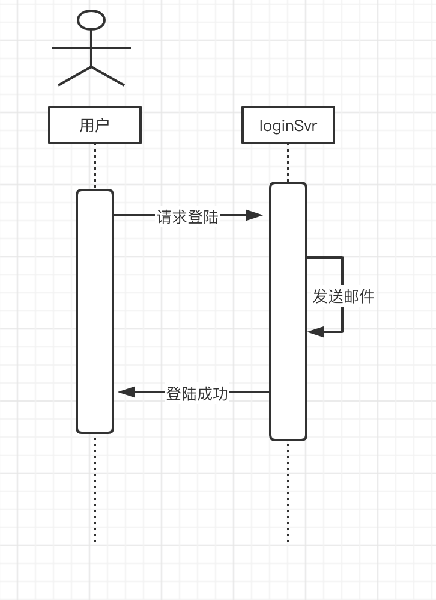
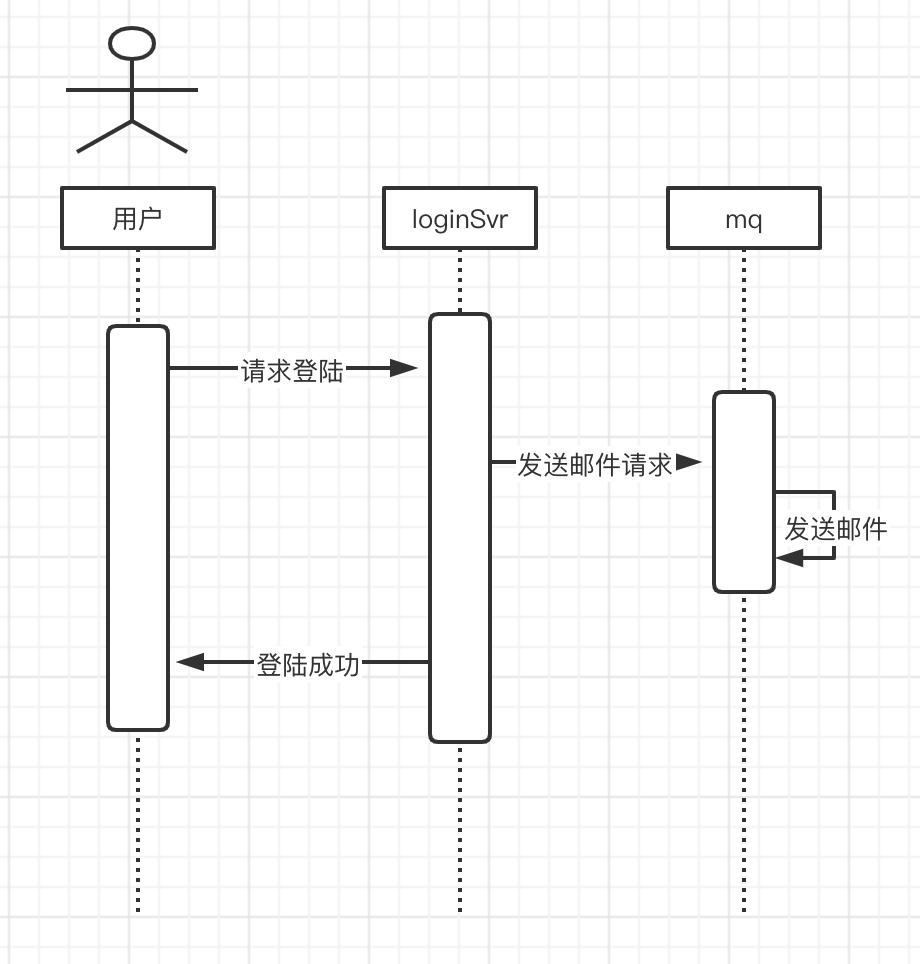

## 前言

> 这周姐姐入职了新公司，老板想探探他的底，看了一眼他的简历，呦呵，精通kafka，这小姑娘有两下子，既然这样，那你写一个消息队列吧。因为要用go语言写，这可给姐姐愁坏了。赶紧来求助我，我这么坚贞不屈一人，在姐姐的软磨硬泡下还是答应他了，所以接下来我就手把手教姐姐怎么写一个消息队列。下面我们就来看一看我是怎么写的吧～～～。


> 本代码已上传到我的github：
>
> 有需要的小伙伴，可自行下载，顺便给个小星星吧～～～


## 什么是消息队列

姐姐真是把我愁坏了，自己写的精通`kafka`，竟然不知道什么是消息队列，于是，一向好脾气的我开始给姐姐讲一讲什么是消息队列。

消息队列，我们一般称它为`MQ（Message Queue）`，两个单词的结合，这两个英文单词想必大家都应该知道吧，其实最熟悉的还是`Queue`吧，即队列。队列是一种先进先出的数据结构，队列的使用还是比较普遍的，但是已经有队列了，怎么还需要`MQ`呢？

> 我：问你呢，姐姐，知道吗？为什么还需要`MQ`？
>
> 姐姐：快点讲，想挨打呀？
>
> 我：噗。。。 算我多嘴，哼～～～

欠欠的我开始了接下来的耐心讲解......

举一个简单的例子，假设现在我们要做一个系统，该登陆系统需要在用户登陆成功后，发送封邮件到用户邮箱进行提醒，需求还是很简单的，我们先开看一看没有`MQ`，我们该怎么实现呢？画一个时序图来看一看：



看这个图，邮件发送在请求登陆时进行，当密码验证成功后，就发送邮件，然后返回登陆成功。这样是可以的，但是他是有缺陷的。这让我们的登陆操作变得复杂了，每次请求登陆都需要进行邮件发送，如果这里出现错误，整个登陆请求也出现了错误，导致登陆不成功；还有一个问题，本来我们登陆请求调用接口仅仅需要100ms，因为中间要做一次发送邮件的等待，那么调用一次登陆接口的时间就要增长，这就是问题所在，一封邮件他的优先级 不是很高的，用户也不需要实时收到这封邮件，所以这时，就体现了消息队列的重要性了，我们用消息队列进行改进一下。



这里我们将发送邮件请求放到`Mq`中，这样我们就能提高用户体验的吞吐量，这个很重要，顾客就是上帝嘛，毕竟也没有人喜欢用一个很慢很慢的app。

这里只是举了`MQ`众多应用中的其中一个，即异步应用，`MQ`还在系统解藕、削峰/限流中有着重要应用，这两个我就不具体讲解了，原理都一样，好好思考一下，你们都能懂得。


## channel

好啦，姐姐终于知道什么是消息队列了，但是现在还是没法进行消息队列开发的，因为还差一个知识点，即go语言中的`channel`。这个很重要，我们还需要靠这个来开发我们的消息队列呢。

因篇幅有限，这里不详细介绍`channel`，只介绍基本使用方法。

### 什么是`channel`

Goroutine 和 Channel 是 Go 语言并发编程的两大基石。Goroutine 用于执行并发任务，Channel 用于 goroutine 之间的同步、通信。Go提倡使用通信的方法代替共享内存，当一个Goroutine需要和其他Goroutine资源共享时，Channel就会在他们之间架起一座桥梁，并提供确保安全同步的机制。`channel`本质上其实还是一个队列，遵循FIFO原则。具体规则如下：

- 先从 Channel 读取数据的 Goroutine 会先接收到数据；
- 先向 Channel 发送数据的 Goroutine 会得到先发送数据的权利；


### 创建通道

创建通道需要用到关键字 **make** ，格式如下：

```go
通道实例 := make(chan 数据类型)
```

- 数据类型：通道内传输的元素类型。
- 通道实例：通过make创建的通道句柄。


### 无缓冲通道的使用

Go语言中无缓冲的通道（unbuffered channel）是指在接收前没有能力保存任何值的通道。这种类型的通道要求发送 goroutine 和接收 goroutine 同时准备好，才能完成发送和接收操作。

无缓冲通道的定义方式如下：

```
通道实例 := make(chan 通道类型)
```

- 通道类型：和无缓冲通道用法一致，影响通道发送和接收的数据类型。
- 缓冲大小：0
- 通道实例：被创建出的通道实例。

写个例子来帮助大家理解一下吧：

```go
package main

import (
    "sync"
    "time"
)

func main() {
    c := make(chan string)

    var wg sync.WaitGroup
    wg.Add(2)

    go func() {
        defer wg.Done()
        c <- `Golang梦工厂`
    }()

    go func() {
        defer wg.Done()

        time.Sleep(time.Second * 1)
        println(`Message: `+ <-c)
    }()

    wg.Wait()
}

```


### 带缓冲的通道的使用

Go语言中有缓冲的通道（buffered channel）是一种在被接收前能存储一个或者多个值的通道。这种类型的通道并不强制要求 goroutine 之间必须同时完成发送和接收。通道会阻塞发送和接收动作的条件也会不同。只有在通道中没有要接收的值时，接收动作才会阻塞。只有在通道没有可用缓冲区容纳被发送的值时，发送动作才会阻塞。

有缓冲通道的定义方式如下：

```
通道实例 := make(chan 通道类型, 缓冲大小)
```

- 通道类型：和无缓冲通道用法一致，影响通道发送和接收的数据类型。
- 缓冲大小：决定通道最多可以保存的元素数量。
- 通道实例：被创建出的通道实例。

来写一个例子讲解一下：

```go
package main

import (
    "sync"
    "time"
)

func main() {
    c := make(chan string, 2)

    var wg sync.WaitGroup
    wg.Add(2)

    go func() {
        defer wg.Done()

        c <- `Golang梦工厂`
        c <- `asong`
    }()

    go func() {
        defer wg.Done()

        time.Sleep(time.Second * 1)
        println(`公众号: `+ <-c)
        println(`作者: `+ <-c)
    }()

    wg.Wait()
}
```


好啦，通道的概念就介绍到这里了，如果需要，下一篇我出一个`channel`详细讲解的文章。


## 消息队列编码实现

### 准备篇

终于开始进入主题了，姐姐都听的快要睡着了，我轰隆一嗓子，立马精神，但是呢，asong也是挨了一顿小电炮，代价惨痛呀，呜呜呜............

在开始编写代码编写直接，我需要构思我们的整个代码架构，这才是正确的编码方式。我们先来定义一个接口，把我们需要实现的方法先列出来，后期对每一个代码进行实现就可以了。因此可以列出如下方法：

```go
type Broker interface {
	publish(topic string, msg interface{}) error
	subscribe(topic string) (<-chan interface{}, error)
	unsubscribe(topic string, sub <-chan interface{}) error
	close()
	broadcast(msg interface{}, subscribers []chan interface{})
	setConditions(capacity int)
}
```

- `publish`：进行消息的推送，有两个参数即`topic`、`msg`，分别是订阅的主题、要传递的消息
- `subscribe`：消息的订阅，传入订阅的主题，即可完成订阅，并返回对应的`channel`通道用来接收数据
- `unsubscribe`：取消订阅，传入订阅的主题和对应的通道
- `close`：这个的作用就是很明显了，就是用来关闭消息队列的
- `broadCast`：这个属于内部方法，作用是进行广播，对推送的消息进行广播，保证每一个订阅者都可以收到
- `setConditions`：这里是用来设置条件，条件就是消息队列的容量，这样我们就可以控制消息队列的大小了

细心的你们有没有发现什么问题，这些代码我都定义的是内部方法，也就是包外不可用。为什么这么做呢，因为这里属于代理要做的事情，我们还需要在封装一层，也就是客户端能直接调用的方法，这样才符合软件架构。因此可以写出如下代码：

```go
package mq


type Client struct {
	bro *BrokerImpl
}

func NewClient() *Client {
	return &Client{
		bro: NewBroker(),
	}
}

func (c *Client)SetConditions(capacity int)  {
	c.bro.setConditions(capacity)
}

func (c *Client)Publish(topic string, msg interface{}) error{
	return c.bro.publish(topic,msg)
}

func (c *Client)Subscribe(topic string) (<-chan interface{}, error){
	return c.bro.subscribe(topic)
}

func (c *Client)Unsubscribe(topic string, sub <-chan interface{}) error {
	return c.bro.unsubscribe(topic,sub)
}

func (c *Client)Close()  {
	 c.bro.close()
}

func (c *Client)GetPayLoad(sub <-chan interface{})  interface{}{
	for val:= range sub{
		if val != nil{
			return val
		}
	}
	return nil
}
```


上面只是准好了代码结构，但是消息队列实现的结构我们还没有设计，现在我们就来设计一下。

```go
type BrokerImpl struct {
	exit chan bool
	capacity int

	topics map[string][]chan interface{} // key： topic  value ： queue
	sync.RWMutex // 同步锁
}
```

- `exit`：也是一个通道，这个用来做关闭消息队列用的
- `capacity`：即用来设置消息队列的容量
- `topics`：这里使用一个map结构，key即是`topic`，其值则是一个切片，`chan`类型，这里这么做的原因是我们一个topic可以有多个订阅者，所以一个订阅者对应着一个通道
- `sync.RWMutex`：读写锁，这里是为了防止并发情况下，数据的推送出现错误，所以采用加锁的方式进行保证


好啦，现在我们已经准备的很充分啦，开始接下来方法填充之旅吧～～～


### `Publish`和`broadcast`

这里两个合在一起讲的原因是`braodcast`是属于`publish`里的。这里的思路很简单，我们只需要把传入的数据进行广播即可了，下面我们来看代码实现：

```go
func (b *BrokerImpl) publish(topic string, pub interface{}) error {
	select {
	case <-b.exit:
		return errors.New("broker closed")
	default:
	}

	b.RLock()
	subscribers, ok := b.topics[topic]
	b.RUnlock()
	if !ok {
		return nil
	}

	b.broadcast(pub, subscribers)
	return nil
}


func (b *BrokerImpl) broadcast(msg interface{}, subscribers []chan interface{}) {
	count := len(subscribers)
	concurrency := 1

	switch {
	case count > 1000:
		concurrency = 3
	case count > 100:
		concurrency = 2
	default:
		concurrency = 1
	}
	pub := func(start int) {
		for j := start; j < count; j += concurrency {
			select {
			case subscribers[j] <- msg:
			case <-time.After(time.Millisecond * 5):
			case <-b.exit:
				return
			}
		}
	}
	for i := 0; i < concurrency; i++ {
		go pub(i)
	}
}
```

`publish`方法中没有什么好讲的，这里主要说一下`broadcast`的实现：

这里主要对数据进行广播，所以数据推送出去就可以了，没必要一直等着他推送成功，所以这里我们我们采用`goroutine`。在推送的时候，当推送失败时，我们也不能一直等待呀，所以这里我们加了一个超时机制，超过5毫秒就停止推送，接着进行下面的推送。

可能你们会有疑惑，上面怎么还有一个`switch`选项呀，干什么用的呢？考虑这样一个问题，当有大量的订阅者时，，比如10000个，我们一个for循环去做消息的推送，那推送一次就会耗费很多时间，并且不同的消费者之间也会产生延时，，所以采用这种方法进行分解可以降低一定的时间。


### `subscribe` 和 `unsubScribe`

我们先来看代码：

```go
func (b *BrokerImpl) subscribe(topic string) (<-chan interface{}, error) {
	select {
	case <-b.exit:
		return nil, errors.New("broker closed")
	default:
	}

	ch := make(chan interface{}, b.capacity)
	b.Lock()
	b.topics[topic] = append(b.topics[topic], ch)
	b.Unlock()
	return ch, nil
}
func (b *BrokerImpl) unsubscribe(topic string, sub <-chan interface{}) error {
	select {
	case <-b.exit:
		return errors.New("broker closed")
	default:
	}

	b.RLock()
	subscribers, ok := b.topics[topic]
	b.RUnlock()

	if !ok {
		return nil
	}
	// delete subscriber
	var newSubs []chan interface{}
	for _, subscriber := range subscribers {
		if subscriber == sub {
			continue
		}
		newSubs = append(newSubs, subscriber)
	}

	b.Lock()
	b.topics[topic] = newSubs
	b.Unlock()
	return nil
}
```

这里其实就很简单了：

- `subscribe`：这里的实现则是为订阅的主题创建一个`channel`，然后将订阅者加入到对应的`topic`中就可以了，并且返回一个接收`channel`。
- `unsubScribe`：这里实现的思路就是将我们刚才添加的`channel`删除就可以了。


### `close`

```go
func (b *BrokerImpl) close()  {
	select {
	case <-b.exit:
		return
	default:
		close(b.exit)
		b.Lock()
		b.topics = make(map[string][]chan interface{})
		b.Unlock()
	}
	return
}
```

这里就是为了关闭整个消息队列，这句代码`b.topics = make(map[string][]chan interface{})`比较重要，这里主要是为了保证下一次使用该消息队列不发生冲突。


### `setConditions` `GetPayLoad`

还差最后两个方法，一个是设置我们的消息队列容量，另一个是封装一个方法来获取我们订阅的消息：

```go
func (b *BrokerImpl)setConditions(capacity int)  {
	b.capacity = capacity
}
func (c *Client)GetPayLoad(sub <-chan interface{})  interface{}{
	for val:= range sub{
		if val != nil{
			return val
		}
	}
	return nil
}
```


### 测试

好啦，代码这么快就被写完了，接下来我们进行测试一下吧。

#### 单元测试

正式测试之前，我们还是需要先进行一下单元测试，养成好的习惯，只有先自测了，才能有底气说我的代码没问题，要不直接跑程序，会出现很多`bug`的。

这里我们测试方法如下：我们向不同的`topic`发送不同的信息，当订阅者收到消息后，就行取消订阅。

```go
func TestClient(t *testing.T) {
	b := NewClient()
	b.SetConditions(100)
	var wg sync.WaitGroup

	for i := 0; i < 100; i++ {
		topic := fmt.Sprintf("Golang梦工厂%d", i)
		payload := fmt.Sprintf("asong%d", i)

		ch, err := b.Subscribe(topic)
		if err != nil {
			t.Fatal(err)
		}

		wg.Add(1)
		go func() {
			e := b.GetPayLoad(ch)
			if e != payload {
				t.Fatalf("%s expected %s but get %s", topic, payload, e)
			}
			if err := b.Unsubscribe(topic, ch); err != nil {
				t.Fatal(err)
			}
			wg.Done()
		}()

		if err := b.Publish(topic, payload); err != nil {
			t.Fatal(err)
		}
	}

	wg.Wait()
}
```

测试通过，没问题，接下来我们在写几个方法测试一下


#### 测试

这里分为两种方式测试

测试一：使用一个定时器，向一个主题定时推送消息.

```go
// 一个topic 测试
func OnceTopic()  {
	m := mq.NewClient()
	m.SetConditions(10)
	ch,err :=m.Subscribe(topic)
	if err != nil{
		fmt.Println("subscribe failed")
		return
	}
	go OncePub(m)
	OnceSub(ch,m)
	defer m.Close()
}

// 定时推送
func OncePub(c *mq.Client)  {
	t := time.NewTicker(10 * time.Second)
	defer t.Stop()
	for  {
		select {
		case <- t.C:
			err := c.Publish(topic,"asong真帅")
			if err != nil{
				fmt.Println("pub message failed")
			}
		default:

		}
	}
}

// 接受订阅消息
func OnceSub(m <-chan interface{},c *mq.Client)  {
	for  {
		val := c.GetPayLoad(m)
		fmt.Printf("get message is %s\n",val)
	}
}
```


测试二：使用一个定时器，定时向多个主题发送消息：

```go
//多个topic测试
func ManyTopic()  {
	m := mq.NewClient()
	defer m.Close()
	m.SetConditions(10)
	top := ""
	for i:=0;i<10;i++{
		top = fmt.Sprintf("Golang梦工厂_%02d",i)
		go Sub(m,top)
	}
	ManyPub(m)
}

func ManyPub(c *mq.Client)  {
	t := time.NewTicker(10 * time.Second)
	defer t.Stop()
	for  {
		select {
		case <- t.C:
			for i:= 0;i<10;i++{
				//多个topic 推送不同的消息
				top := fmt.Sprintf("Golang梦工厂_%02d",i)
				payload := fmt.Sprintf("asong真帅_%02d",i)
				err := c.Publish(top,payload)
				if err != nil{
					fmt.Println("pub message failed")
				}
			}
		default:

		}
	}
}

func Sub(c *mq.Client,top string)  {
	ch,err := c.Subscribe(top)
	if err != nil{
		fmt.Printf("sub top:%s failed\n",top)
	}
	for  {
		val := c.GetPayLoad(ch)
		if val != nil{
			fmt.Printf("%s get message is %s\n",top,val)
		}
	}
}
```


## 总结

终于帮助姐姐解决了这个问题，姐姐开心死了，给我一顿亲，啊不对，是一顿夸，夸的人家都不好意思了。

这一篇你学会了吗？没学会不要紧，赶快去把源代码下载下来，好好通读一下，很好理解的～～～。

其实这一篇是为了接下来的kafka学习打基础的，学好了这一篇，接下来学习的kafka就会容易很多啦～～～

> github地址：https://github.com/asong2020/Golang_Dream/tree/master/code_demo/queue
>
> 如果能给一个小星星就好了～～～

**结尾给大家发一个小福利吧，最近我在看[微服务架构设计模式]这一本书，讲的很好，自己也收集了一本PDF，有需要的小伙可以到自行下载。获取方式：关注公众号：[Golang梦工厂]，后台回复：[微服务]，即可获取。**

**我翻译了一份GIN中文文档，会定期进行维护，有需要的小伙伴后台回复[gin]即可下载。**

**我是asong，一名普普通通的程序猿，让我一起慢慢变强吧。我自己建了一个`golang`交流群，有需要的小伙伴加我`vx`,我拉你入群。欢迎各位的关注，我们下期见~~~**


推荐往期文章：

- [详解Context包，看这一篇就够了！！！](https://mp.weixin.qq.com/s/JKMHUpwXzLoSzWt_ElptFg)

- [go-ElasticSearch入门看这一篇就够了(一)](https://mp.weixin.qq.com/s/mV2hnfctQuRLRKpPPT9XRw)

- [面试官：go中for-range使用过吗？这几个问题你能解释一下原因吗](https://mp.weixin.qq.com/s/G7z80u83LTgLyfHgzgrd9g)

- [学会wire依赖注入、cron定时任务其实就这么简单！](https://mp.weixin.qq.com/s/qmbCmwZGmqKIZDlNs_a3Vw)

- [听说你还不会jwt和swagger-饭我都不吃了带着实践项目我就来了](https://mp.weixin.qq.com/s/z-PGZE84STccvfkf8ehTgA)
- [掌握这些Go语言特性，你的水平将提高N个档次(二)](https://mp.weixin.qq.com/s/7yyo83SzgQbEB7QWGY7k-w)
- [go实现多人聊天室，在这里你想聊什么都可以的啦！！！](https://mp.weixin.qq.com/s/H7F85CncQNdnPsjvGiemtg)
- [grpc实践-学会grpc就是这么简单](https://mp.weixin.qq.com/s/mOkihZEO7uwEAnnRKGdkLA)
- [go标准库rpc实践](https://mp.weixin.qq.com/s/d0xKVe_Cq1WsUGZxIlU8mw)
- [2020最新Gin框架中文文档 asong又捡起来了英语，用心翻译](https://mp.weixin.qq.com/s/vx8A6EEO2mgEMteUZNzkDg)
- [基于gin的几种热加载方式](https://mp.weixin.qq.com/s/CZvjXp3dimU-2hZlvsLfsw)
- [boss: 这小子还不会使用validator库进行数据校验，开了～～～](https://mp.weixin.qq.com/s?__biz=MzIzMDU0MTA3Nw==&mid=2247483829&idx=1&sn=d7cf4f46ea038a68e74a4bf00bbf64a9&scene=19&token=1606435091&lang=zh_CN#wechat_redirect)