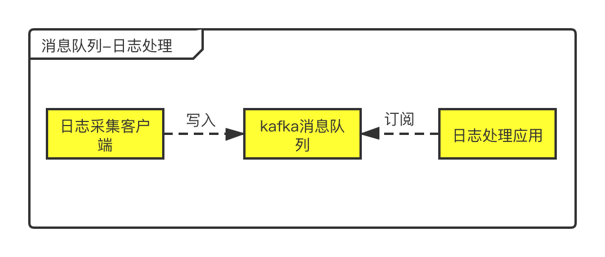

## 前言

> 昨天发了一篇文章是关于`machinery`的入门教程，有一位读者在留言中问我 这个和kafka有什么区别？一时我也有点懵，这两个的概念很近，到底有什么不同呢？根据我自己的理解，简单分析了一下，有不足之处欢迎指出。

## 消息队列

消息队列这个概念其实在我之前的文章：[手把手教姐姐写消息队列](https://mp.weixin.qq.com/s/0MykGst1e2pgnXXUjojvhQ)，自己动手用go写一个简易版的消息队列，有兴趣的小伙伴们可以看一下这篇文章。回归正题，我们再来介绍一下什么是消息队列。

消息队列，一般我们会简称它为MQ(Message Queue)。他是由两个单词组成，我们应该对队列(Queue)很熟悉吧。队列是一种先进先出的数据结构。再配合上消息，消息队列可以简单理解为：把要传输的数据放在队列中。使用较多的消息队列有ActiveMQ，RabbitMQ，ZeroMQ，Kafka，MetaMQ，RocketMQ。这里我们就不具体讲解消息队列实现细节，这不是本文的主题，只知道概念就可以了。了解了什么是消息队列，我们一起来看看他在什么场景使用。

### 场景

消息队列中间件是分布式系统中重要的组件，主要解决应用耦合，异步消息，流量削锋等问题。这里举一个消息队列的使用场景：日志处理。

日志处理是指将消息队列用在日志处理中，比如Kafka的应用，解决大量日志传输的问题。架构简化如下：

