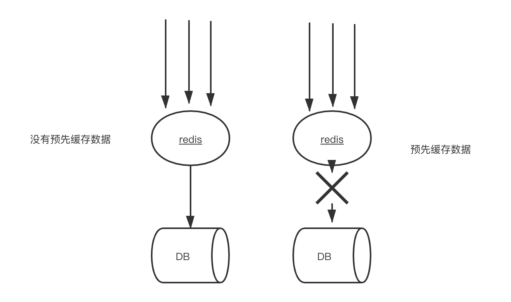
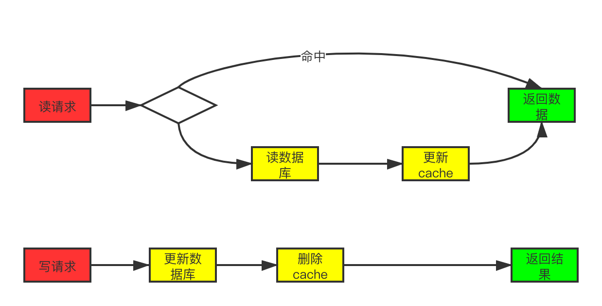

## 前言

> Hello，everybody，我是asong，上一篇文章我们一起聊一聊了面试中几个常见的缓存问题，今天我依然聊一聊缓存，不过今天我们聊的不是面试了，我们一起来看一看我们在系统中缓存更新的设计，因自己经验有限，所以这些缓存设计来源于网上，我只是在这里总结一下，有什么不对的欢迎指出～～～😊。

## 缓存预热 To solve 缓存冷启动

在上一篇文章中[[常见面试题之缓存雪崩、缓存穿透、缓存击穿](https://mp.weixin.qq.com/s?__biz=MzIzMDU0MTA3Nw==&mid=2247483988&idx=1&sn=3bd52650907867d65f1c4d5c3cff8f13&chksm=e8b0902edfc71938f7d7a29246d7278ac48e6c104ba27c684e12e840892252b0823de94b94c1&token=1558933779&lang=zh_CN#rd)]，忘记讲了一个概念——缓存预热，所以在这篇文章补充一下，开一个好头，预热嘛～～～。

什么是缓存预热呢？我们都知道平常在跑步前都要热身，可以预防肌肉拉伤等一系例的好处。所以缓存预热具有同样的道理，我们的新系统上线后，我们可以将相关的缓存数据直接加载到缓存系统。这样可以避免在用户请求的时候，先去查询数据库，然后再将数据缓存的问题。用户可以直接查询事先已被预热的缓存数据。其实缓存预热是为了解决缓存冷启动问题，我们新系统上线后，redis集群启动后，没有任何的缓存数据，这就是redis的冷启动。

如上图所示，如果不进行预热，那么Redis初识状态数据为空，系统上线初期，对于高并发的流量，都会访问到数据库中，对数据库造成流量的压力。

### 如何解决

现在我们已经知道会有缓存预热这个问题，那么就要想一下对策咯。可以分析出以下两点：

- 需要统计访问频度较高的热点数据
- 使用LRU数据删除策略，构建数据留存队列

所以我们可以设计一个如下方案：

- 首先，通过 nginx + lua 的方式，把访问流量数据上报到 Kafka，也可以是其它的 mq 队列。
- 然后使用实时计算框架(如 storm 、spark streaming、flume)从 kafka 中消费访问流量数据，实时计算出访问频率高的数据，这里统计出来的可能只会有编号信息，如商品编号或博客编号等。
- 最后，根据编号从 mysql 数据库中查询出具体的信息，写入 redis，开始提供服务。

## 缓存更新的几种设计

### 1. 先删除缓存，在更新数据库

虽然这是一种错误方法，但是这种设计也是属于缓存更新的一种方法，所以大家还是要知道为什么不可以这么做。还是那句话：知其所以然嘛。

这种方法就是在更新数据库时，先删除缓存，然后在更新数据库，而后续的操作会把数据在装载到缓存中，这种逻辑在并发时就会先脏数据，看如下图：

我们解释一下上图的操作，两个并发操作，一个是更新操作，另一个是查询操作，更新操作删除缓存后，查询操作没有命中缓存，先把老数据读出来后放到缓存中，然后更新操作更新了数据库。于是，在缓存中的数据还是老的数据，导致缓存中的数据是脏的，而且还一直这样脏下去了。所以这个设计是错误的，不建议使用。

### 2. Cache aside

这是我们最常用的一种设计模式，其逻辑如下：

- 查询：程序先从cache中获取数据，有数据直接返回，没有得到，则去数据库中取数据，成功后更新到缓存中。
- 更新：先把数据存到数据库中，成功后，再让缓存失效。

这种设计正好能解决上文出现脏数据的问题。我们来理一下，一个是查询操作，一个是更新操作的并发，没有了删除cache数据的操作了，而是先更新了数据库中的数据，此时，缓存依旧有效，所以，并发的查询操作拿的是没有更新的数据，但是，更新操作马上让缓存的失效了，后续的查询操作再把数据从数据库中拉出来。而不会像文章开头的那个逻辑产生的问题，后续的查询操作一直都在取老的数据。

那么是不是这种设计就不会存在并发问题了呢？不是的，比如，一个是读操作，但是没有命中缓存，然后就到数据库中取数据，此时来了一个写操作，写完数据库后，让缓存失效，然后，之前的那个读操作再把老的数据放进去，所以，会造成脏数据。但，这个case理论上会出现，不过，实际上出现的概率可能非常低，因为这个条件需要发生在读缓存时缓存失效，而且并发着有一个写操作。而实际上数据库的写操作会比读操作慢得多，而且还要锁表，而读操作必需在写操作前进入数据库操作，而又要晚于写操作更新缓存，所有的这些条件都具备的概率基本并不大。

我们可以为缓存设置上过期时间，这样可以有效解决这个问题。

### 3. Read/Write Through

这个模式其实就是将 缓存服务 作为主要的存储，应用的所有读写请求都是直接与缓存服务打交道，而不管最后端的数据库了，数据库的数据由缓存服务来维护和更新。不过缓存中数据变更的时候是同步去更新数据库的，在应用的眼中只有缓存服务。
流程如下：

- Read Through

Read Through 套路就是在查询操作中更新缓存，也就是说，当缓存失效的时候（过期或LRU换出），Cache Aside是由调用方负责把数据加载入缓存，而Read Through则用缓存服务自己来加载，从而对应用方是透明的。

- Write Through

Write Through 套路和Read Through相仿，不过是在更新数据时发生。当有数据更新的时候，如果没有命中缓存，直接更新数据库，然后返回。如果命中了缓存，则更新缓存，然后再由Cache自己更新数据库（这是一个同步操作）

这个模式的特点就是出现脏数据的概率就比较低，但是就强依赖缓存了，对缓存服务的稳定性有较大要求，另外，增加新缓存节点时还会有初始状态空数据问题。

### 4. Write Behind Caching

Write Behind Caching又叫做Write Back，就是在更新数据的时候，只更新缓存，不更新数据库，而缓存会异步地批量更新数据库。这个设计的好处是让数据的I/O操作可以很快，异步的操作还可以合并对同一个数据的多次操作，性能上是非常可观的。

但是，其带来的问题是，数据不是强一致性的，而且可能会丢失。在软件设计上，我们基本上不可能做出一个没有缺陷的设计，就像算法设计中的时间换空间，空间换时间一个道理，有时候，强一致性和高性能，高可用和高性性是有冲突的。软件设计从来都是取舍Trade-Off。另外，Write Back实现逻辑比较复杂，因为他需要track有哪数据是被更新了的，需要刷到持久层上。操作系统的write back会在仅当这个cache需要失效的时候，才会被真正持久起来，比如，内存不够了，或是进程退出了等情况，这又叫lazy write。

这个模式的特点就是速度很快，效率会非常高，但是数据的一致性比较差，还可能会有数据的丢失情况，实现逻辑也较为复杂。

## 总结

上面讲的这几种缓存更新设计，都是一些前人使用的总结，这些设计也不是完美的，这个世界上没有完美的设计，所以我们的设计多多少少会有问题，比如我们没有考虑缓存（Cache）和持久层（Repository）的整体事务的问题。比如，更新Cache成功，更新数据库失败了怎么吗？或是反过来。关于这个事，如果你需要强一致性，就要好好考虑怎么解决这个问题。在软件开发或设计中，我非常建议在之前先去参考一下已有的设计和思路，**看看相应的guideline，best practice或design pattern，吃透了已有的这些东西，再决定是否要重新发明轮子**。千万不要似是而非地，想当然的做软件设计。

好啦，这一篇文章到这里就结束了，希望对你们有用，又不对的地方欢迎指出，可添加我的golang交流群，我们一起学习交流。

**结尾给大家发一个小福利吧，最近我在看[微服务架构设计模式]这一本书，讲的很好，自己也收集了一本PDF，有需要的小伙可以到自行下载。获取方式：关注公众号：[Golang梦工厂]，后台回复：[微服务]，即可获取。**

**我翻译了一份GIN中文文档，会定期进行维护，有需要的小伙伴后台回复[gin]即可下载。**

**我是asong，一名普普通通的程序猿，让我一起慢慢变强吧。我自己建了一个`golang`交流群，有需要的小伙伴加我`vx`,我拉你入群。欢迎各位的关注，我们下期见~~~**

推荐往期文章：

- [手把手教姐姐写消息队列](https://mp.weixin.qq.com/s/0MykGst1e2pgnXXUjojvhQ)
- [常见面试题之缓存雪崩、缓存穿透、缓存击穿](https://mp.weixin.qq.com/s?__biz=MzIzMDU0MTA3Nw==&mid=2247483988&idx=1&sn=3bd52650907867d65f1c4d5c3cff8f13&chksm=e8b0902edfc71938f7d7a29246d7278ac48e6c104ba27c684e12e840892252b0823de94b94c1&token=1558933779&lang=zh_CN#rd)
- [详解Context包，看这一篇就够了！！！](https://mp.weixin.qq.com/s/JKMHUpwXzLoSzWt_ElptFg)
- [go-ElasticSearch入门看这一篇就够了(一)](https://mp.weixin.qq.com/s/mV2hnfctQuRLRKpPPT9XRw)
- [面试官：go中for-range使用过吗？这几个问题你能解释一下原因吗](https://mp.weixin.qq.com/s/G7z80u83LTgLyfHgzgrd9g)
- [学会wire依赖注入、cron定时任务其实就这么简单！](https://mp.weixin.qq.com/s/qmbCmwZGmqKIZDlNs_a3Vw)
- [听说你还不会jwt和swagger-饭我都不吃了带着实践项目我就来了](https://mp.weixin.qq.com/s/z-PGZE84STccvfkf8ehTgA)
- [掌握这些Go语言特性，你的水平将提高N个档次(二)](https://mp.weixin.qq.com/s/7yyo83SzgQbEB7QWGY7k-w)
- [go实现多人聊天室，在这里你想聊什么都可以的啦！！！](https://mp.weixin.qq.com/s/H7F85CncQNdnPsjvGiemtg)
- [grpc实践-学会grpc就是这么简单](https://mp.weixin.qq.com/s/mOkihZEO7uwEAnnRKGdkLA)
- [go标准库rpc实践](https://mp.weixin.qq.com/s/d0xKVe_Cq1WsUGZxIlU8mw)
- [2020最新Gin框架中文文档 asong又捡起来了英语，用心翻译](https://mp.weixin.qq.com/s/vx8A6EEO2mgEMteUZNzkDg)
- [基于gin的几种热加载方式](https://mp.weixin.qq.com/s/CZvjXp3dimU-2hZlvsLfsw)

