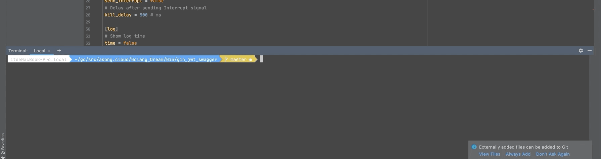
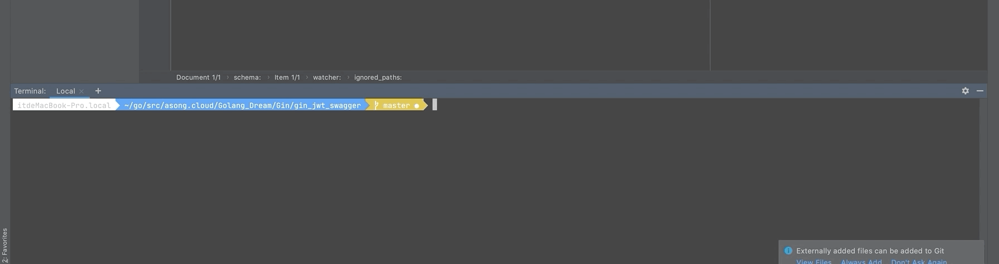

## 前言

哈喽，大家好，我是asong，这是我的第九篇原创文章。今天给大介绍几种热加载的方法，大大提高我们的开发效率。本篇文章的所有实现都是基于GIN框架的，公众号有2020最新官方中文文档，后台回复：GIN（不区分大小写）即可获取。

本文的所有项目效果演示都是基于gin_jwt_swagger开源项目，项目地址：https://github.com/asong2020/Golang_Dream/tree/master/Gin/gin_jwt_swagger。欢迎Star与使用。

文章链接：[听说你还不会jwt和swagger-饭我都不吃了带着实践项目我就来了](https://mp.weixin.qq.com/s/z-PGZE84STccvfkf8ehTgA)

## 什么是热加载

如果你是一名python开发者，应该很熟悉这个。我们在Flask或者Django框架下开发都是支持实时加载的，当我们对代码进行修改时，程序能够自动重新加载并执行，这在我们开发中是非常便利的，可以快速进行代码测试，省去了每次手动重新编译。

如果你是一名JAVA开发者，不仅会听过热加载，热部署会跟着一块出现。热部署一般是指容器（支持多应用）不重启，单独启动单个应用。热加载一般指重启应用（JVM），单独重新更新某个类或者配置文件。

知道了什么是热加载了，想在项目开发中使用，该怎么做呢？下面就来介绍几种方法，想用哪个就用哪个，就是这么豪横。哼！！！


### 1. Air

`github地址：https://github.com/cosmtrek/air` `Star:1.8k`

它具有以下特性：

- 彩色日志输出
- 自定义构建或二进制命令
- 支持忽略子目录
- 启动后支持监听新目录
- 更好的构建过程

#### 安装

```shell
$ go get -u github.com/cosmtrek/air
```


#### 使用

为了我们能够好的使用命令行操作，我们需要把`alias air='~/.air'`加到你的`.bashrc`或`.zshrc`中，根据你的系统进行选择，因为我是mac，所以我将`alias air='~/.air'`加到了`vim ~/.zshrc`中了。

然后命令下执行如下操作

```shell
# 1. 进入你自己的项目目录
$ cd /your_project
# 2. 查找你的项目中是否存在 `.air.conf` 配置文件
$ air -c .air.conf
# 3. 没有则创建一个
$ touch .air.conf
# 4. 复制下面示例 `air.conf.example`到你的 `.air.conf`

# 5. 启动热加载
$ air 
# 6. 启动热加载 带打印log
$ air -d
```


#### air.conf.example示例

参考：[传送门](https://github.com/cosmtrek/air/blob/master/air_example.toml)

```go
root = "."
tmp_dir = "tmp"

[build]
# Just plain old shell command. You could use `make` as well.
cmd = "go build -o ./tmp/main ."
# Binary file yields from `cmd`.
bin = "tmp/main"
# Customize binary.
full_bin = "APP_ENV=dev APP_USER=air ./tmp/main"
# Watch these filename extensions.
include_ext = ["go", "tpl", "tmpl", "html"]
# Ignore these filename extensions or directories.
exclude_dir = ["assets", "tmp", "vendor", "frontend/node_modules"]
# Watch these directories if you specified.
include_dir = []
# Exclude files.
exclude_file = []
# This log file places in your tmp_dir.
log = "air.log"
# It's not necessary to trigger build each time file changes if it's too frequent.
delay = 1000 # ms
# Stop running old binary when build errors occur.
stop_on_error = true
# Send Interrupt signal before killing process (windows does not support this feature)
send_interrupt = false
# Delay after sending Interrupt signal
kill_delay = 500 # ms

[log]
# Show log time
time = false

[color]
# Customize each part's color. If no color found, use the raw app log.
main = "magenta"
watcher = "cyan"
build = "yellow"
runner = "green"

[misc]
# Delete tmp directory on exit
clean_on_exit = true
```


#### 效果演示


## 2. Fresh

`github地址：https://github.com/gravityblast/fresh` `Star:2.8K`

Fresh是一个命令行工具，每次保存Go或模版文件时，该工具都会生成或重新启动Web应用程序。Fresh将监视文件事件，并且每次创建/修改/删除文件时，Fresh都会生成并重新启动应用程序。如果go build返回错误，它会将记录在tmp文件夹中。

#### 安装

```go
$ go get github.com/pilu/fresh
```


#### 使用

```shell
# 进入你的项目目录
$ cd /your_project
# 启动
$ fresh
```


#### 效果演示


## 3. bee

`github地址：https://github.com/beego/bee` `Satr:1.1K`

bee是beego框架的热编译工具，同样可以对GIN框架进行热编译，使用起来很方便，功能也有很多，这里就不展开了，喜欢的可以去看文档，解锁更多玩法。


#### 安装

```shell
# To install bee use the go get command:
$ go get github.com/beego/bee
# If you already have bee installed, updating bee is simple:
$ go get -u github.com/beego/bee
# Then you can add bee binary to PATH environment variable in your ~/.bashrc or ~/.bash_profile file:
$ export PATH=$PATH:<your_main_gopath>/bin
```


#### 使用

```shell
# 进入你的项目目录，注意：使用bee 项目必须要在GOPATH目录下
$ cd /your_project
# 运行程序
$ bee run
```

#### 效果演示


## 4. gowatch

`github地址：https://github.com/silenceper/gowatch` `Star`

Go程序热编译工具，通过监听当前目录下的相关文件变动，进行实时编译。


#### 安装

```shell
$ go get github.com/silenceper/gowatch
```


#### 使用

安装完成后可以直接使用gowatch命令，命令行参数如下：

- -o : 非必须，指定build的目标文件路径
- -p : 非必须，指定需要build的package（也可以是单个文件）
- -args: 非必须，指定程序运行时参数，例如：-args='-host=:8080,-name=demo'
- -v: 非必须，显示gowatch版本信息

```shell
$ gowatch -o ./bin/demo -p ./cmd/demo
```

gowatch可以修改配置文件`gowatch.yml`

大部分情况下，不需要更改配置，直接执行`gowatch`命令就能满足的大部分的需要，但是也提供了一些配置用于自定义，在执行目录下创建`gowatch.yml`文件:

```yaml
# gowatch.yml 配置示例

# 当前目录执行下生成的可执行文件的名字，默认是当前目录名
appname: "test"
# 指定编译后的目标文件目录
output: /bin/demo
# 需要追加监听的文件名后缀，默认只有'.go'文件
watch_exts:
    - .yml
# 需要监听的目录，默认只有当前目录
watch_paths:
    - ../pk
# 在执行命令时，需要增加的其他参数
cmd_args:
    - arg1=val1
# 在构建命令时，需要增加的其他参数
build_args:
    - -race
# 需要增加环境变量，默认已加载当前环境变量
envs:
    - a=b
# 是否监听 ‘vendor’ 文件夹下的文件改变
vendor_watch: false
# 不需要监听的目录名字
excluded_paths:
    - path
# main 包路径，也可以是单个文件，多个文件使用逗号分隔
build_pkg: ""
# build tags
build_tags: ""

# 是否禁止自动运行
disable_run: false
```


#### 项目演示


## 5. gin

`github地址:https://github.com/codegangsta/gin` `Star:3.4K`

`gin`是用于实时重新加载Go Web应用程序的简单命令行实用程序。只需`gin`在您的应用程序目录中运行，您的网络应用程序将 `gin`作为代理提供。`gin`检测到更改后，将自动重新编译您的代码。您的应用在下次收到HTTP请求时将重新启动。

`gin` 坚持“沉默就是黄金”的原则，因此，只有在出现编译器错误或在错误发生后成功进行编译时，它才会抱怨。


#### 安装

```shell
$ go get github.com/codegangsta/gin
# Then verify that gin was installed correctly:
$ gin -h
```


#### 使用

```shell
$ gin run main.go
```

Options:

```shell
 --laddr value, -l value       listening address for the proxy server
   --port value, -p value        port for the proxy server (default: 3000)
   --appPort value, -a value     port for the Go web server (default: 3001)
   --bin value, -b value         name of generated binary file (default: "gin-bin")
   --path value, -t value        Path to watch files from (default: ".")
   --build value, -d value       Path to build files from (defaults to same value as --path)
   --excludeDir value, -x value  Relative directories to exclude
   --immediate, -i               run the server immediately after it's built
   --all                         reloads whenever any file changes, as opposed to reloading only on .go file change
   --godep, -g                   use godep when building
   --buildArgs value             Additional go build arguments
   --certFile value              TLS Certificate
   --keyFile value               TLS Certificate Key
   --logPrefix value             Setup custom log prefix
   --notifications               enable desktop notifications
   --help, -h                    show help
   --version, -v                 print the version
```


#### 项目演示




## 6. realize

`github地址：https://github.com/oxequa/realize` `Star:3.8K`

realize是Golang的实时重载和任务运行器。它主要功能如下：

- 高性能实时刷新。
- 同时管理多个项目。
- 通过自定义扩展名和路径观看。
- 支持所有Go命令。
- 在不同的Go版本之间切换。
- 项目的自定义环境变量。
- 在文件更改前后或全局执行自定义命令。
- 将日志和错误导出到外部文件。
- 分步项目初始化。
- 重新设计的面板，显示构建错误，控制台输出和警告。


#### 安装

```shell
$ go get github.com/oxequa/realize
```

我直接这么安装失败了，出现了错误，我的GO版本是1.14，所以使用如下方式安装成功：

```shell
$  GO111MODULE=off go get github.com/oxequa/realize
```


#### 使用

```shell
# 首先进行初始化 默认配置即可
$ realize init
# 执行项目
$ realize start
# 添加命令
$ realize add
# 删除命令
$ realize init
```

Options:

```shell
--name="name"               -> Run by name on existing configuration
--path="realize/server"     -> Custom Path (if not specified takes the working directory name)
--generate                  -> Enable go generate
--fmt                       -> Enable go fmt
--test                      -> Enable go test
--vet                       -> Enable go vet
--install                   -> Enable go install
--build                     -> Enable go build
--run                       -> Enable go run
--server                    -> Enable the web server
--open                      -> Open web ui in default browser
--no-config                 -> Ignore an existing config / skip the creation of a new one
```

Examples:

```shell
$ realize start
$ realize start --path="mypath"
$ realize start --name="realize" --build
$ realize start --path="realize" --run --no-config
$ realize start --install --test --fmt --no-config
$ realize start --path="/Users/username/go/src/github.com/oxequa/realize-examples/coin/"
```

realize 使用方法比较多，感兴趣的可以去官方文档学习。


#### 项目演示




## 总结

好啦，这一篇文章到此就结束啦。总结了6种热加载的方法，每一种都有各自的特点，根据喜欢的喜好，选择一款呗，大大提高我们的开发效率呦！！！

**我是asong，一名想要变强的小小程序猿。欢迎各位的关注，我们下期见！！！**


推荐往期文章：

- [听说你还不会jwt和swagger-饭我都不吃了带着实践项目我就来了](https://mp.weixin.qq.com/s/z-PGZE84STccvfkf8ehTgA)
- [掌握这些Go语言特性，你的水平将提高N个档次(二)](https://mp.weixin.qq.com/s/7yyo83SzgQbEB7QWGY7k-w)
- [go实现多人聊天室，在这里你想聊什么都可以的啦！！！](https://mp.weixin.qq.com/s/H7F85CncQNdnPsjvGiemtg)
- [grpc实践-学会grpc就是这么简单](https://mp.weixin.qq.com/s/mOkihZEO7uwEAnnRKGdkLA)
- [go标准库rpc实践](https://mp.weixin.qq.com/s/d0xKVe_Cq1WsUGZxIlU8mw)
- [2020最新Gin框架中文文档 asong又捡起来了英语，用心翻译](https://mp.weixin.qq.com/s/vx8A6EEO2mgEMteUZNzkDg)