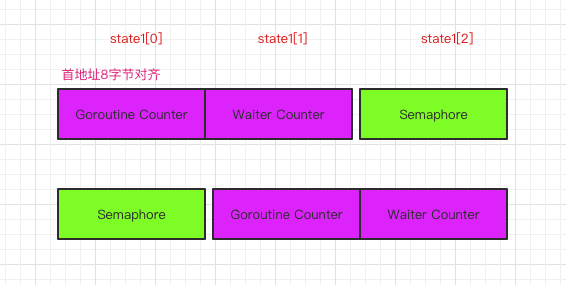

## 前言

> 哈喽，大家好，我是`asong`，这是我并发编程系列的第三篇文章，上一篇我们一起分析了[`sync.once`的使用与实现](https://mp.weixin.qq.com/s/gT9bNsNhU189PsURJyzsmQ)，今天我们一起来看一看`sync.WaitGroup`的使用与实现.
>
> 快过年了，这是年前最后一篇推文了，待我积累一下，年后加大力度写干货，在这里先预祝大家新春快乐，身体健康，万事如意！


## 什么是`sync.WaitGroup`

官方文档对`sync.WatiGroup`的描述是：一个`waitGroup`对象可以等待一组协程结束，也就等待一组`goroutine`返回。有了`sync.Waitgroup`我们可以将原本顺序执行的代码在多个`Goroutine`中并发执行，加快程序处理的速度。其实他与`java`中的`CountdownLatch`，阻塞等待所有任务完成之后再继续执行。我们来看官网给的一个例子，这个例子使用`waitGroup`阻塞主进程，并发获取多个`URL`，直到完成所有获取：

```go
package main

import (
	"sync"
)

type httpPkg struct{}

func (httpPkg) Get(url string) {}

var http httpPkg

func main() {
	var wg sync.WaitGroup
	var urls = []string{
		"http://www.golang.org/",
		"http://www.google.com/",
		"http://www.somestupidname.com/",
	}
	for _, url := range urls {
		// Increment the WaitGroup counter.
		wg.Add(1)
		// Launch a goroutine to fetch the URL.
		go func(url string) {
			// Decrement the counter when the goroutine completes.
			defer wg.Done()
			// Fetch the URL.
			http.Get(url)
		}(url)
	}
	// Wait for all HTTP fetches to complete.
	wg.Wait()
}
```

首先我们需要声明一个`sync.WaitGroup`对象，在主`gorourine`调用`Add()`方法设置要等待的`goroutine`数量，每一个`Goroutine`在运行结束时要调用`Done()`方法，同时使用`Wait()`方法进行阻塞直到所有的`goroutine`完成。


## 为什么要用`sync.waitGroup`

我们在日常开发中为了提高接口响应时间，有一些场景需要在多个`goroutine`中做一些互不影响的业务，这样可以节省不少时间，但是需要协调多个`goroutine`，没有`sync.WaitGroup`的时候，我们可以使用通道来解决这个问题，我们把主`Goroutine`当成铜锣扛把子a song，把每一个`Goroutine`当成一个马仔，`asong`管理这些马仔，让这些马仔去收保护费，我今天派10个马仔去收保护费，每一个马仔收好了保护费就在账本上打一个✅，当所有马仔都收好了保护费，账本上就被打满了✅，活全被干完了，很出色，然后酒吧走起，浪一浪，全场的消费松公子买单，写成代码可以这样表示：

```go

func exampleImplWaitGroup()  {
	done := make(chan struct{}) // 收10份保护费
	count := 10 // 10个马仔
	for i:=0;i < count;i++{
		go func(i int) {
			defer func() {
				done <- struct {}{}
			}()
			fmt.Printf("马仔%d号收保护费\n",i)
		}(i)
	}
	for i:=0;i< count;i++{
		<- done
		fmt.Printf("马仔%d号已经收完保护费\n",i)
	}
	fmt.Println("所有马仔已经干完活了，开始酒吧消费～")
}
```

虽然这样可以实现，但是我们每次使用都要保证主`Goroutine`最后从通道接收的次数需要与之前其他的`Goroutine`发送元素的次数相同，实现起来不够优雅，在这种场景下我们就可以选用`sync.WaitGroup`来帮助我们实现同步。


## 源码剖析

前面我们已经知道`sync.waitGroup`的基本使用了，接下来我们就一起看看他是怎样实现的～，只有知其所以然，才能写出更健壮的代码。

Go version: 1.15.3

首先我们看一下`sync.WaitGroup`的结构：

```go
// A WaitGroup must not be copied after first use.
type WaitGroup struct {
	noCopy noCopy

	// 64-bit value: high 32 bits are counter, low 32 bits are waiter count.
	// 64-bit atomic operations require 64-bit alignment, but 32-bit
	// compilers do not ensure it. So we allocate 12 bytes and then use
	// the aligned 8 bytes in them as state, and the other 4 as storage
	// for the sema.
	state1 [3]uint32
}
```

总共就有两个字段，`nocopy`是为了保证该结构不会被进行拷贝，这是一种保护机制，会在后面进行介绍；`state1`主要是存储着状态和信号量，这里使用的8字节对齐处理的方式很有意思，我先来一起看看这种处理。


### `state1`状态和信号量处理

`state1`这里总共被分配了`12`个字节，这里被设计了三种状态：

- 其中对齐的`8`个字节作为状态，高`32`位为计数的数量，低`32`位为等待的`goroutine`数量
- 其中的`4`个字节作为信号量存储

提供了`(wg *WaitGroup) state() (statep *uint64, semap *uint32)`帮助我们从`state1`字段中取出他的状态和信号量，为什么要这样设计呢？

我们在分析[`atomic`](https://mp.weixin.qq.com/s/PQ06eL8kMWoGXodpnyjNcA)和[Go看源码必会知识之unsafe包](https://mp.weixin.qq.com/s/nPWvqaQiQ6Z0TaPoqg3t2Q)有说到过，64位原子操作需要64位对齐，但是32位编译器不能保证这一点，所以为了保证`waitGroup`在`32`位平台上使用的话，就必须保证在任何时候，`64位`操作不会报错。所以也就不能分成两个字段来写，考虑到字段顺序不同、平台不同，内存对齐也就不同。因此这里采用动态识别当前我们操作的`64`位数到底是不是在`8`字节对齐的位置上面，我们来分析一下`state`方法：

```go
// state returns pointers to the state and sema fields stored within wg.state1.
func (wg *WaitGroup) state() (statep *uint64, semap *uint32) {
	if uintptr(unsafe.Pointer(&wg.state1))%8 == 0 {
		return (*uint64)(unsafe.Pointer(&wg.state1)), &wg.state1[2]
	} else {
		return (*uint64)(unsafe.Pointer(&wg.state1[1])), &wg.state1[0]
	}
}
```

当数组的首地址是处于一个`8`字节对齐的位置上时，那么就将这个数组的前`8`个字节作为`64`位值使用表示状态，后`4`个字节作为`32`位值表示信号量(`semaphore`)。同理如果首地址没有处于`8`字节对齐的位置上时，那么就将前`4`个字节作为`semaphore`，后`8`个字节作为`64`位数值。画个图表示一下：




## `Add()`、`Done()`方法

`sync.WaitGroup`提供了`Add()`方法增加一个计数器，`Done()`方法减掉一个计数，`Done()`方法实现比较简单，内部调用的`Add()`方法实现的计数器减一操作，也就是增减逻辑都在`Add()`方法中，所以我们重点看一下`Add()`是如何实现的：

```go
func (wg *WaitGroup) Add(delta int) {
  // 获取状态(Goroutine Counter 和 Waiter Counter)和信号量
	statep, semap := wg.state()
	if race.Enabled {
		_ = *statep // trigger nil deref early
		if delta < 0 {
			// Synchronize decrements with Wait.
			race.ReleaseMerge(unsafe.Pointer(wg))
		}
		race.Disable()
		defer race.Enable()
	}
  // 原子操作，goroutine counter累加delta
	state := atomic.AddUint64(statep, uint64(delta)<<32)
  // 获取当前goroutine counter的值(高32位)
	v := int32(state >> 32)
  // 获取当前waiter counter的值(低32位)
	w := uint32(state)
	if race.Enabled && delta > 0 && v == int32(delta) {
		// The first increment must be synchronized with Wait.
		// Need to model this as a read, because there can be
		// several concurrent wg.counter transitions from 0.
		race.Read(unsafe.Pointer(semap))
	}
  // Goroutine counter是不允许为负数的，否则会发生panic
	if v < 0 {
		panic("sync: negative WaitGroup counter")
	}
  // 当wait的Goroutine不为0时，累加后的counter值和delta相等,说明Add()和Wait()同时调用了,所以发生panic,因为正确的做法是先Add()后Wait()，也就是已经调用了wait()就不允许再添加任务了
	if w != 0 && delta > 0 && v == int32(delta) {
		panic("sync: WaitGroup misuse: Add called concurrently with Wait")
	}
  // 正常`Add()`方法后，`goroutine Counter`计数器大于0或者`waiter Counter`计数器等于0时，不需要释放信号量
	if v > 0 || w == 0 {
		return
	}
	// 能走到这里说明当前Goroutine Counter计数器为0，Waiter Counter计数器大于0, 到这里数据也就是允许发生变动了，如果发生变动了，则出发panic
	if *statep != state {
		panic("sync: WaitGroup misuse: Add called concurrently with Wait")
	}
	// 重置状态，并发出信号量告诉wait所有任务已经完成
	*statep = 0
	for ; w != 0; w-- {
		runtime_Semrelease(semap, false, 0)
	}
}
```

上面的代码有一部分是`race`静态检测，下面的分析会省略这一部分，因为它并不是本文的重点。

注释我都添加到对应的代码行上了，你是否都看懂了，没看懂不要紧，因为`Add()`是与`Wait()`方法一块使用的，所以有些逻辑与`wait()`里的逻辑是相互照应的，所以当我们看完`wait()`方法的实现在总结一下你们就明白了。


### `Wait()`方法

`sync.Wait()`方法会阻塞主`Goroutine`直到`WaitGroup`计数器变为0。我们一起来看一下`Wait()`方法的源码：

```go
// Wait blocks until the WaitGroup counter is zero.
func (wg *WaitGroup) Wait() {
  // 获取状态(Goroutine Counter 和 Waiter Counter)和信号量
	statep, semap := wg.state()
	if race.Enabled {
		_ = *statep // trigger nil deref early
		race.Disable()
	}
	for {
    // 使用原子操作读取state，是为了保证Add中的写入操作已经完成
		state := atomic.LoadUint64(statep)
    // 获取当前goroutine counter的值(高32位)
		v := int32(state >> 32)
     // 获取当前waiter counter的值(低32位)
		w := uint32(state)
    // 如果没有任务，或者任务已经在调用`wait`方法前已经执行完成了，就不用阻塞了
		if v == 0 {
			// Counter is 0, no need to wait.
			if race.Enabled {
				race.Enable()
				race.Acquire(unsafe.Pointer(wg))
			}
			return
		}
		// 使用CAS操作对`waiter Counter`计数器进行+1操作，外面有for循环保证这里可以进行重试操作
		if atomic.CompareAndSwapUint64(statep, state, state+1) {
			if race.Enabled && w == 0 {
				// Wait must be synchronized with the first Add.
				// Need to model this is as a write to race with the read in Add.
				// As a consequence, can do the write only for the first waiter,
				// otherwise concurrent Waits will race with each other.
				race.Write(unsafe.Pointer(semap))
			}
      // 在这里获取信号量，使线程进入睡眠状态，与Add方法中最后的增加信号量相对应，也就是当最后一个任务调用Done方法
      // 后会调用Add方法对goroutine counter的值减到0，就会走到最后的增加信号量
			runtime_Semacquire(semap)
      // 在Add方法中增加信号量时已经将statep的值设为0了，如果这里不是0，说明在wait之后又调用了Add方法，使用时机不对，触发panic
			if *statep != 0 {
				panic("sync: WaitGroup is reused before previous Wait has returned")
			}
			if race.Enabled {
				race.Enable()
				race.Acquire(unsafe.Pointer(wg))
			}
			return
		}
	}
}

```


### 源码总结

分了源码，我们可以总结如下：

- `Add`方法与`wait`方法不可以并发同时调用，`Add`方法要在`wait`方法之前调用.
- `Add()`设置的值必须与实际等待的`goroutine`个数一致，否则会`panic`.
- 调用了`wait`方法后，必须要在`wait`方法返回以后才能再次重新使用`waitGroup`，也就是`Wait`没有返回之前不要在调用`Add`方法，否则会发生`Panic`.
- `Done` 只是对`Add` 方法的简单封装，我们可以向 `Add`方法传入任意负数（需要保证计数器非负）快速将计数器归零以唤醒等待的 `Goroutine`.
- `waitGroup`对象只能有一份，不可以拷贝给其他变量，否则会造成意想不到的`Bug`.


## `no copy`机制

在前文看`waitGroup`结构时，有一个`nocopy`字段，为什么要有`nocopy`呢？我们先看这样一个例子：

```go
type User struct {
	Name string
	Info *Info
}

type Info struct {
	Age int
	Number int
}


func main()  {
	u := User{
		Name: "asong",
		Info: &Info{
			Age: 10,
			Number: 24,
		},
	}
	u1 := u
	u1.Name = "Golang梦工厂"
	u1.Info.Age = 30
	fmt.Println(u.Info.Age,u.Name)
	fmt.Println(u1.Info.Age,u1.Name)
}
// 运行结果
30 asong
30 Golang梦工厂
```

结构体`User`中有两个字段`Name`和`Info`，`Name`是`String`类型，`Info`是指向结构体`Info`的指针类型，我们首先声明了一个`u`变量，对他进行复制拷贝得到变量`u1`，在`u1`中对两个字段进行改变，可以看到`Info`字段发生了更改，而`Name`就没发生更改，这就引发了安全问题，如果结构体对象包含指针字段，当该对象被拷贝时，会使得两个对象中的指针字段变得不再安全。

`Go`语言中提供了两种`copy`检查，一种是在运行时进行检查，一种是通过静态检查。不过运行检查是比较影响程序的执行性能的，Go官方目前只提供了strings.Builder和sync.Cond的runtime拷贝检查机制，对于其他需要nocopy对象类型来说，使用go vet工具来做静态编译检查。运行检查的实现可以通过比较所属对象是否发生变更就可以判断，而静态检查是提供了一个`nocopy`对象，只要是该对象或对象中存在`nocopy`字段，他就实现了`sync.Locker`接口, 它拥有Lock()和Unlock()方法，之后，可以通过go vet功能，来检查代码中该对象是否有被copy。

## 踩坑事项

在文章的最后总结一下使用`waitGroup`易错的知识点，防止大家再次犯错。

1. `waitGroup`中计数器的值是不能小于0的，源码中我们就可以看到，一旦小于0就会引发panic。
2. 一定要住注意调用`Add`方法与`Wait`方法的顺序，不可并发同时调用这两个方法，否则就会引发panic，同时在调用了`wait`方法在其没有释放前不要再次调用`Add`方法，这样也会引发`panic`，`waitGroup`是可以复用的，但是需要保证其计数周期的完整性。
3. `WaitGroup`对象不是一个引用类型，通过函数传值的时候需要使用地址，因为`Go`语言只有值传递，传递`WaitGroup`是值的话，就会导致会发生`panic`，看这样一个例子：

```go
func main()  {
	wg := sync.WaitGroup{}
	wg.Add(1)
	doDeadLock(wg)
	wg.Wait()
}
func doDeadLock(wg sync.WaitGroup)  {
	defer wg.Done()
	fmt.Println("do something")
}
//运行结果：panic: sync: negative WaitGroup counter
```

发生这个问题的原因就是在`doDeadLock()`方法中`wg`是一个新对象，直接调用`Done`方法，计数器就会出现负数，所以引发`panic`，为了安全起见，对于这种传结构体的场景一般建议都传指针就好了，基本可以避免一些问题。

4. Add()设置的值必须与实际等待的goroutine个数一致，否则会`panic`，很重要的一点，也是很容易出错的地方。


## 思考题

最后给大家出一个思考题，下面这段代码会不会发生`panic`：

```go
func main() {
	wg := sync.WaitGroup{}
	wg.Add(100)
	for i := 0; i < 100; i++ {
		go func() {
			defer wg.Done()
			fmt.Println(i)
		}()
	}
	wg.Wait()
}
```


## 结尾

**在最后，祝大家新年快乐，心想事成，万事如意～～～**

**好啦，这篇文章就到这里啦，素质三连（分享、点赞、在看）都是笔者持续创作更多优质内容的动力！**

**创建了一个Golang学习交流群，欢迎各位大佬们踊跃入群，我们一起学习交流。入群方式：加我vx拉你入群，或者公众号获取入群二维码**

**结尾给大家发一个小福利吧，最近我在看[微服务架构设计模式]这一本书，讲的很好，自己也收集了一本PDF，有需要的小伙可以到自行下载。获取方式：关注公众号：[Golang梦工厂]，后台回复：[微服务]，即可获取。**

**我翻译了一份GIN中文文档，会定期进行维护，有需要的小伙伴后台回复[gin]即可下载。**

**翻译了一份Machinery中文文档，会定期进行维护，有需要的小伙伴们后台回复[machinery]即可获取。**

**我是asong，一名普普通通的程序猿，让我们一起慢慢变强吧。欢迎各位的关注，我们下期见~~~**


推荐往期文章：

- [Go看源码必会知识之unsafe包](https://mp.weixin.qq.com/s/nPWvqaQiQ6Z0TaPoqg3t2Q)
- [源码剖析panic与recover，看不懂你打我好了！](https://mp.weixin.qq.com/s/mzSCWI8C_ByIPbb07XYFTQ)
- [详解并发编程基础之原子操作(atomic包)](https://mp.weixin.qq.com/s/PQ06eL8kMWoGXodpnyjNcA)
- [详解defer实现机制](https://mp.weixin.qq.com/s/FUmoBB8OHNSfy7STR0GsWw)
- [真的理解interface了嘛](https://mp.weixin.qq.com/s/sO6Phr9C5VwcSTQQjJux3g)
- [Leaf—Segment分布式ID生成系统（Golang实现版本）](https://mp.weixin.qq.com/s/wURQFRt2ISz66icW7jbHFw)
- [十张动图带你搞懂排序算法(附go实现代码)](https://mp.weixin.qq.com/s/rZBsoKuS-ORvV3kML39jKw)
- [go参数传递类型](https://mp.weixin.qq.com/s/JHbFh2GhoKewlemq7iI59Q)
- [手把手教姐姐写消息队列](https://mp.weixin.qq.com/s/0MykGst1e2pgnXXUjojvhQ)
- [常见面试题之缓存雪崩、缓存穿透、缓存击穿](https://mp.weixin.qq.com/s?__biz=MzIzMDU0MTA3Nw==&mid=2247483988&idx=1&sn=3bd52650907867d65f1c4d5c3cff8f13&chksm=e8b0902edfc71938f7d7a29246d7278ac48e6c104ba27c684e12e840892252b0823de94b94c1&token=1558933779&lang=zh_CN#rd)
- [详解Context包，看这一篇就够了！！！](https://mp.weixin.qq.com/s/JKMHUpwXzLoSzWt_ElptFg)
- [go-ElasticSearch入门看这一篇就够了(一)](https://mp.weixin.qq.com/s/mV2hnfctQuRLRKpPPT9XRw)
- [面试官：go中for-range使用过吗？这几个问题你能解释一下原因吗](https://mp.weixin.qq.com/s/G7z80u83LTgLyfHgzgrd9g)


