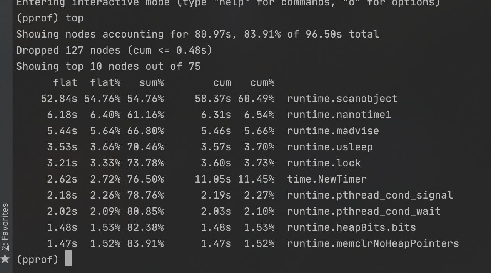
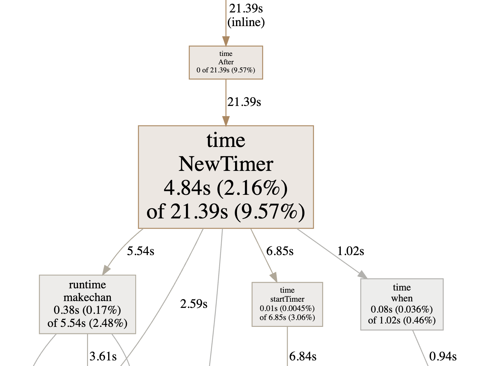

## 前言

> 嗨，大家好，我是asong，我今天又来了。昨天发表了一篇文章：[手把手教姐姐写消息队列](https://mp.weixin.qq.com/s/0MykGst1e2pgnXXUjojvhQ)，其中一段代码被细心的读者发现了有内存泄漏的危险，确实是这样，自己没有注意到这方面，追求完美的我，马上进行了排查并更改了这个`bug`。现在我就把这个`bug`分享一下，避免小伙伴们后续踩坑。

> 测试代码已经放到了github：https://github.com/asong2020/Golang_Dream/tree/master/code_demo/time_oom_validate
>
> 欢迎star～～～


## 背景

我先贴一下会发生内存泄漏的代码段，根据代码可以更好的进行讲解：

```go
func (b *BrokerImpl) broadcast(msg interface{}, subscribers []chan interface{}) {
	count := len(subscribers)
	concurrency := 1

	switch {
	case count > 1000:
		concurrency = 3
	case count > 100:
		concurrency = 2
	default:
		concurrency = 1
	}

	pub := func(start int) {
		for j := start; j < count; j += concurrency {
			select {
			case subscribers[j] <- msg:
        case <-time.After(time.Millisecond * 5):
			case <-b.exit:
				return
			}
		}
	}
	for i := 0; i < concurrency; i++ {
		go pub(i)
	}
}
```

看了这段代码，你知道是哪里发生内存泄漏了嘛？我先来告诉大家，这里`time.After(time.Millisecond * 5)`会发生内存泄漏，具体原因嘛别着急，我们一步步分析。


## 验证

我们来写一段代码进行验证，先看代码吧：

```go
package main

import (
	"fmt"
	"net/http"
	_ "net/http/pprof"
	"time"
)

/**
	time.After oom 验证demo
 */
func main()  {
	ch := make(chan string,100)

	go func() {
		for  {
			ch <- "asong"
		}
	}()
	go func() {
		// 开启pprof，监听请求
		ip := "127.0.0.1:6060"
		if err := http.ListenAndServe(ip, nil); err != nil {
			fmt.Printf("start pprof failed on %s\n", ip)
		}
	}()

	for  {
		select {
		case <-ch:
		case <- time.After(time.Minute * 3):
		}
	}
}
```

这段代码我们该怎么验证呢？看代码估计你们也猜到了，没错就是`go tool pprof`，可能有些小伙伴不知道这个工具，那我简单介绍一下基本使用，不做详细介绍，更多功能可自行学习。

再介绍`pprof`之前，我们其实还有一种方法，可以测试此段代码是否发生了内存泄漏，就是使用`top`命令查看该进程占用`cpu`情况，输入`top`命令，我们会看到`cpu`一直在飙升，这种方法可以确定发生内存泄漏，但是不能确定发生问题的代码在哪部分，所以最好还是使用`pprof`工具进行分析，他可以确定具体出现问题的代码。

### proof 介绍

定位goroutine泄露会使用到pprof，pprof是Go的性能工具，在程序运行过程中，可以记录程序的运行信息，可以是CPU使用情况、内存使用情况、goroutine运行情况等，当需要性能调优或者定位Bug时候，这些记录的信息是相当重要。使用pprof有多种方式，Go已经现成封装好了1个：`net/http/pprof`，使用简单的几行命令，就可以开启pprof，记录运行信息，并且提供了Web服务，能够通过浏览器和命令行2种方式获取运行数据。

基本使用也很简单，看这段代码：

```go
package main

import (
    "fmt"
    "net/http"
    _ "net/http/pprof"
)

func main() {
    // 开启pprof，监听请求
    ip := "127.0.0.1:6060"
    if err := http.ListenAndServe(ip, nil); err != nil {
        fmt.Printf("start pprof failed on %s\n", ip)
    }
}
```

使用还是很简单的吧，这样我们就开启了`go tool pprof`。下面我们开始实践来说明`pprof`的使用。


### 验证流程

首先我们先运行我的测试代码，然后打开我们的终端输入如下命令：

```shell
$ go tool pprof http://127.0.0.1:6060/debug/pprof/profile -seconds 60
```

这里的作用是使用`go tool pprof`命令获取指定的profile文件，采集60s的`CPU`使用情况，会将采集的数据下载到本地，之后进入交互模式，可以使用命令行查看运行信息。

进入命令行交互模式后，我们输入`top`命令查看内存占用情况。



第一次接触的不知道这些参数的意思，我们先来解释一下各个参数吧，`top`会列出5个统计数据：

- flat: 本函数占用的内存量。
- flat%: 本函数内存占使用中内存总量的百分比。
- sum%: 前面每一行flat百分比的和，比如第2行虽然的100% 是 100% + 0%。
- cum: 是累计量，加入main函数调用了函数f，函数f占用的内存量，也会记进来。
- cum%: 是累计量占总量的百分比。

这个我们可以看出`time.NewTimer`占用内存很高，这么看也不是很直观，我们可以使用火焰图来查看，打开终端输入如下命令即可：

```shell
# pprof.samples.cpu.001.pb.gz 	这个要看你们输入上面命令生成的文件名
$ go tool pprof -http=:8081 ~/pprof/pprof.samples.cpu.001.pb.gz
```

浏览器会自动弹出，看下图：



我们可以看到`time.NewTimer`这个方法导致调用链占了很长时间，占用CPU很长时间，这种方法可以帮我定位到出现问题的代码，还是很方便的。知道了什么问题，接下来我们就来分析一下原因吧。


## 原因分析

分析具体原因之前，我们先来了解一下go中两个定时器`ticker`和`timer`，因为不知道这两个的使用，确实不知道具体原因。

### ticker和timer

Golang中time包有两个定时器，分别为ticker 和 timer。两者都可以实现定时功能，但各自都有自己的使用场景。

我们来看一下他们的区别：

- ticker定时器表示每隔一段时间就执行一次，一般可执行多次。
- timer定时器表示在一段时间后执行，默认情况下只执行一次，如果想再次执行的话，每次都需要调用 time.Reset()方法，此时效果类似ticker定时器。同时也可以调用stop()方法取消定时器
- timer定时器比ticker定时器多一个Reset()方法，两者都有Stop()方法，表示停止定时器,底层都调用了stopTimer()函数。


### 原因

上面我们了介绍go的两个定时器，现在我们回到我们的问题，我们的代码使用time.After来做超时控制，`time.After`其实内部调用的就是`timer`定时器，根据`timer`定时器的特点，具体原因就很明显了。

这里我们的定时时间设置的是3分钟， 在for循环每次select的时候，都会实例化一个一个新的定时器。该定时器在3分钟后，才会被激活，但是激活后已经跟select无引用关系，被gc给清理掉。这里最关键的一点是**在计时器触发之前，垃圾收集器不会回收 Timer**，换句话说，被遗弃的time.After定时任务还是在时间堆里面，定时任务未到期之前，是不会被gc清理的，所以这就是会造成内存泄漏的原因。每次循环实例化的新定时器对象需要3分钟才会可能被GC清理掉，如果我们把上面代码中的3分钟改小点，会有所改善，但是仍存在风险，下面我们就使用正确的方法来修复这个bug。


## 修复bug

### 方法一：使用`timer`定时器

`time.After`虽然调用的是`timer`定时器，但是他没有使用`time.Reset()` 方法再次激活定时器，所以每一次都是新创建的实例，才会造成的内存泄漏，我们添加上`time.Reset`每次重新激活定时器，即可完成解决问题。

```go
func (b *BrokerImpl) broadcast(msg interface{}, subscribers []chan interface{}) {
	count := len(subscribers)
	concurrency := 1

	switch {
	case count > 1000:
		concurrency = 3
	case count > 100:
		concurrency = 2
	default:
		concurrency = 1
	}

	//采用Timer 而不是使用time.After 原因：time.After会产生内存泄漏 在计时器触发之前，垃圾回收器不会回收Timer
	idleDuration := 5 * time.Millisecond
	idleTimeout := time.NewTimer(idleDuration)
	defer idleTimeout.Stop()
	pub := func(start int) {
		for j := start; j < count; j += concurrency {
			idleTimeout.Reset(idleDuration)
			select {
			case subscribers[j] <- msg:
			case <-idleTimeout.C:
			case <-b.exit:
				return
			}
		}
	}
	for i := 0; i < concurrency; i++ {
		go pub(i)
	}
}
```


### 方法二：ticker定时器

直接使用`ticker`定时器就好啦，因为`ticker`每隔一段时间就执行一次，一般可执行多次，相当于`timer`定时器调用了`time.Reset`。

```go
func (b *BrokerImpl) broadcast(msg interface{}, subscribers []chan interface{}) {
	count := len(subscribers)
	concurrency := 1

	switch {
	case count > 1000:
		concurrency = 3
	case count > 100:
		concurrency = 2
	default:
		concurrency = 1
	}

	//采用Timer 而不是使用time.After 原因：time.After会产生内存泄漏 在计时器触发之前，垃圾回收器不会回收Timer
	idleTimeout := time.time.NewTicker(5 * time.Millisecond)
	defer idleTimeout.Stop()
	pub := func(start int) {
		for j := start; j < count; j += concurrency {
			select {
			case subscribers[j] <- msg:
			case <-idleTimeout.C:
			case <-b.exit:
				return
			}
		}
	}
	for i := 0; i < concurrency; i++ {
		go pub(i)
	}
}
```


## 总结

>  不知道这篇文章你们看懂了吗？没看懂的可以下载测试代码，自己测试一下，更能加深印象的呦～～～
>
> 这篇文章主要介绍了排查问题的思路，`go tool pprof`这个工具很重要，遇到性能和内存gc问题，都可以使用golang tool pprof来排查分析问题。不会的小伙伴还是要学起来的呀～～～
>
> 最后感谢指出问题的那位网友，让我又有所收获，非常感谢，所以说嘛，还是要共同进步的呀，你不会的，并不代表别人不会，虚心使人进步嘛，加油各位小伙伴们～～～


**结尾给大家发一个小福利吧，最近我在看[微服务架构设计模式]这一本书，讲的很好，自己也收集了一本PDF，有需要的小伙可以到自行下载。获取方式：关注公众号：[Golang梦工厂]，后台回复：[微服务]，即可获取。**

**我翻译了一份GIN中文文档，会定期进行维护，有需要的小伙伴后台回复[gin]即可下载。**

**我是asong，一名普普通通的程序猿，让我一起慢慢变强吧。我自己建了一个`golang`交流群，有需要的小伙伴加我`vx`,我拉你入群。欢迎各位的关注，我们下期见~~~**


推荐往期文章：

- [手把手教姐姐写消息队列](https://mp.weixin.qq.com/s/0MykGst1e2pgnXXUjojvhQ)

- [详解Context包，看这一篇就够了！！！](https://mp.weixin.qq.com/s/JKMHUpwXzLoSzWt_ElptFg)
- [go-ElasticSearch入门看这一篇就够了(一)](https://mp.weixin.qq.com/s/mV2hnfctQuRLRKpPPT9XRw)
- [面试官：go中for-range使用过吗？这几个问题你能解释一下原因吗](https://mp.weixin.qq.com/s/G7z80u83LTgLyfHgzgrd9g)
- [学会wire依赖注入、cron定时任务其实就这么简单！](https://mp.weixin.qq.com/s/qmbCmwZGmqKIZDlNs_a3Vw)
- [听说你还不会jwt和swagger-饭我都不吃了带着实践项目我就来了](https://mp.weixin.qq.com/s/z-PGZE84STccvfkf8ehTgA)
- [掌握这些Go语言特性，你的水平将提高N个档次(二)](https://mp.weixin.qq.com/s/7yyo83SzgQbEB7QWGY7k-w)

- [go实现多人聊天室，在这里你想聊什么都可以的啦！！！](https://mp.weixin.qq.com/s/H7F85CncQNdnPsjvGiemtg)
- [grpc实践-学会grpc就是这么简单](https://mp.weixin.qq.com/s/mOkihZEO7uwEAnnRKGdkLA)
- [go标准库rpc实践](https://mp.weixin.qq.com/s/d0xKVe_Cq1WsUGZxIlU8mw)
- [2020最新Gin框架中文文档 asong又捡起来了英语，用心翻译](https://mp.weixin.qq.com/s/vx8A6EEO2mgEMteUZNzkDg)
- [基于gin的几种热加载方式](https://mp.weixin.qq.com/s/CZvjXp3dimU-2hZlvsLfsw)
- [boss: 这小子还不会使用validator库进行数据校验，开了～～～](https://mp.weixin.qq.com/s?__biz=MzIzMDU0MTA3Nw==&mid=2247483829&idx=1&sn=d7cf4f46ea038a68e74a4bf00bbf64a9&scene=19&token=1606435091&lang=zh_CN#wechat_redirect)

