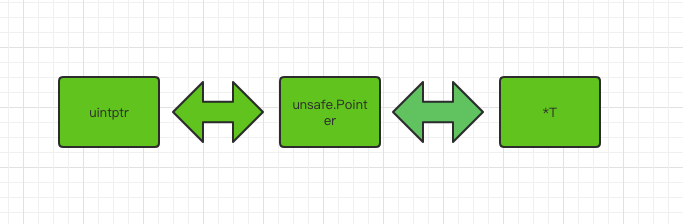
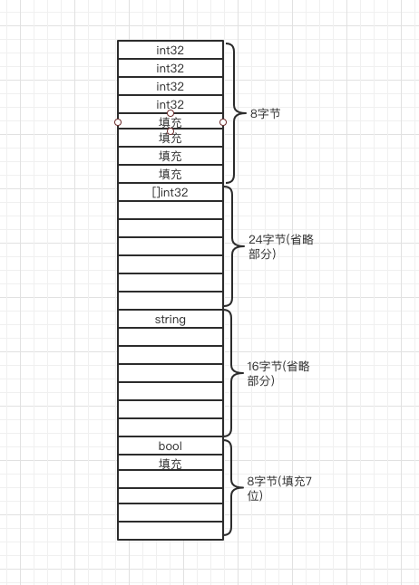

## 前言

> 有看源码的朋友应该会发现，`Go`标准库中大量使用了`unsafe.pointer`，要想更好的理解源码实现，就要知道`unsafe.pointer`到底是什么？所以今天就与大家来聊一聊`unsafe`包。  


## 什么是`unsafe`

众所周知，`Go语言`被设计成一门强类型的静态语言，那么他的类型就不能改变了，静态也是意味着类型检查在运行前就做了。所以在`Go`语言中是不允许两个指针类型进行转换的，使用过`C`语言的朋友应该知道这在`C`语言中是可以实现的，`Go`中不允许这么使用是处于安全考虑，毕竟强制转型会引起各种各样的麻烦，有时这些麻烦很容易被察觉，有时他们却又隐藏极深，难以察觉。大多数读者可能不明白为什么类型转换是不安全的，这里用`C`语言举一个简单的例子：

```c
int main(){
  double pi = 3.1415926;
  double *pv = &pi;
 	void *temp = pd;
  int *p = temp;
}
```

在标准`C语言`中，任何非`void`类型的指针都可以和`void`类型的指针相互指派，也可以通过`void`类型指针作为中介，实现不同类型的指针间接相互转换。上面示例中，指针`pv`指向的空间本是一个双精度数据，占`8`个字节，但是经过转换后，`p`指向的是一个`4`字节的`int`类型。这种发生内存截断的设计缺陷会在转换后进行内存访问是存在安全隐患。我想这就是`Go`语言被设计成强类型语言的原因之一吧。

虽然类型转换是不安全的，但是在一些特殊场景下，使用了它，可以打破`Go`的类型和内存安全机制，可以绕过类型系统低效，提高运行效率。所以`Go`标准库中提供了一个`unsafe`包，之所以叫这个名字，就是不推荐大家使用，但是不是不能用，如果你掌握的特别好，还是可以实践的。


## `unsafe` 实现原理

在使用之前我们先来看一下`unsafe`的源码部分，标准库`unsafe`包中只提供了`3`种方法，分别是:

```go
func Sizeof(x ArbitraryType) uintptr
func Offsetof(x ArbitraryType) uintptr
func Alignof(x ArbitraryType) uintptr
```

- `Sizeof(x ArbitrayType)`方法主要作用是用返回类型`x`所占据的字节数，但并不包含`x`所指向的内容的大小，与`C`语言标准库中的`Sizeof()`方法功能一样，比如在`32`位机器上，一个指针返回大小就是4字节。
- `Offsetof(x ArbitraryType)`方法主要作用是返回结构体成员在内存中的位置离结构体起始处(结构体的第一个字段的偏移量都是0)的字节数，即偏移量，我们在注释中看一看到其入参必须是一个结构体，其返回值是一个常量。
- `Alignof(x ArbitratyType)`的主要作用是返回一个类型的对齐值，也可以叫做对齐系数或者对齐倍数。对齐值是一个和内存对齐有关的值，合理的内存对齐可以提高内存读写的性能。一般对齐值是`2^n`，最大不会超过`8`(受内存对齐影响).获取对齐值还可以使用反射包的函数，也就是说：`unsafe.Alignof(x)`等价于`reflect.TypeOf(x).Align()`。对于任意类型的变量`x`，`unsafe.Alignof(x)`至少为1。对于`struct`结构体类型的变量`x`，计算`x`每一个字段`f`的`unsafe.Alignof(x，f)`，`unsafe.Alignof(x)`等于其中的最大值。对于`array`数组类型的变量`x`，`unsafe.Alignof(x)`等于构成数组的元素类型的对齐倍数。没有任何字段的空`struct{}`和没有任何元素的`array`占据的内存空间大小为`0`，不同大小为`0`的变量可能指向同一块地址。

细心的朋友会发发现这三个方法返回的都是`uintptr`类型，这个目的就是可以和`unsafe.poniter`类型相互转换，因为`*T`是不能计算偏移量的，也不能进行计算，但是`uintptr`是可以的，所以可以使用`uintptr`类型进行计算，这样就可以可以访问特定的内存了，达到对不同的内存读写的目的。三个方法的入参都是`ArbitraryType`类型，代表着任意类型的意思，同时还提供了一个`Pointer`指针类型，即像`void *`一样的通用型指针。

```go
type ArbitraryType int
type Pointer *ArbitraryType
// uintptr 是一个整数类型，它足够大，可以存储
type uintptr uintptr
```

上面说了这么多，可能会有点懵，在这里对三种指针类型做一个总结：

- `*T`：普通类型指针类型，用于传递对象地址，不能进行指针运算。
- `unsafe.poniter`：通用指针类型，用于转换不同类型的指针，不能进行指针运算，不能读取内存存储的值(需转换到某一类型的普通指针)
- `uintptr`：用于指针运算，`GC`不把`uintptr`当指针，`uintptr`无法持有对象。`uintptr`类型的目标会被回收。

三者关系就是：`unsafe.Pointer`是桥梁，可以让任意类型的指针实现相互转换，也可以将任意类型的指针转换为`uintptr`进行指针运算，也就说`uintptr`是用来与`unsafe.Pointer`打配合，用于指针运算。画个图表示一下：



基本原理就说到这里啦，接下来我们一起来看看如何使用~


## `unsafe.Pointer`基本使用

我们在上一篇分析[`atomic.Value`源码时](https://mp.weixin.qq.com/s/PQ06eL8kMWoGXodpnyjNcA)，看到`atomic/value.go`中定义了一个`ifaceWords`结构，其中`typ`和`data`字段类型就是`unsafe.Poniter`，这里使用`unsafe.Poniter`类型的原因是传入的值就是`interface{}`类型，使用`unsafe.Pointer`强转成`ifaceWords`类型，这样可以把类型和值都保存了下来，方便后面的写入类型检查。截取部分代码如下：

```go
// ifaceWords is interface{} internal representation.
type ifaceWords struct {
	typ  unsafe.Pointer
	data unsafe.Pointer
}
// Load returns the value set by the most recent Store.
// It returns nil if there has been no call to Store for this Value.
func (v *Value) Load() (x interface{}) {
	vp := (*ifaceWords)(unsafe.Pointer(v))
  for {
		typ := LoadPointer(&vp.typ) // 读取已经存在值的类型
    /**
    ..... 中间省略
    **/
    // First store completed. Check type and overwrite data.
		if typ != xp.typ { //当前类型与要存入的类型做对比
			panic("sync/atomic: store of inconsistently typed value into Value")
		}
}
```

上面就是源码中使用`unsafe.Pointer`的一个例子，有一天当你准备读源码时，`unsafe.pointer`的使用到处可见。好啦，接下来我们写一个简单的例子，看看`unsafe.Pointer`是如何使用的。

```go
func main()  {
	number := 5
	pointer := &number
	fmt.Printf("number:addr:%p, value:%d\n",pointer,*pointer)

	float32Number := (*float32)(unsafe.Pointer(pointer))
	*float32Number = *float32Number + 3

	fmt.Printf("float64:addr:%p, value:%f\n",float32Number,*float32Number)
}
```

运行结果：

```go
number:addr:0xc000018090, value:5
float64:addr:0xc000018090, value:3.000000
```

由运行可知使用`unsafe.Pointer`强制类型转换后指针指向的地址是没有改变，只是类型发生了改变。这个例子本身没什么意义，正常项目中也不会这样使用。

总结一下基本使用：先把`*T`类型转换成`unsafe.Pointer`类型，然后在进行强制转换转成你需要的指针类型即可。

## `Sizeof、Alignof、Offsetof`三个函数的基本使用

先看一个例子：

```go
type User struct {
	Name string
	Age uint32
	Gender bool // 男:true 女：false 就是举个例子别吐槽我这么用。。。。
}

func func_example()  {
	// sizeof
	fmt.Println(unsafe.Sizeof(true))
	fmt.Println(unsafe.Sizeof(int8(0)))
	fmt.Println(unsafe.Sizeof(int16(10)))
	fmt.Println(unsafe.Sizeof(int(10)))
	fmt.Println(unsafe.Sizeof(int32(190)))
	fmt.Println(unsafe.Sizeof("asong"))
	fmt.Println(unsafe.Sizeof([]int{1,3,4}))
	// Offsetof
	user := User{Name: "Asong", Age: 23,Gender: true}
	userNamePointer := unsafe.Pointer(&user)

	nNamePointer := (*string)(unsafe.Pointer(userNamePointer))
	*nNamePointer = "Golang梦工厂"

	nAgePointer := (*uint32)(unsafe.Pointer(uintptr(userNamePointer) + unsafe.Offsetof(user.Age)))
	*nAgePointer = 25

	nGender := (*bool)(unsafe.Pointer(uintptr(userNamePointer)+unsafe.Offsetof(user.Gender)))
	*nGender = false

	fmt.Printf("u.Name: %s, u.Age: %d,  u.Gender: %v\n", user.Name, user.Age,user.Gender)
	// Alignof
	var b bool
	var i8 int8
	var i16 int16
	var i64 int64
	var f32 float32
	var s string
	var m map[string]string
	var p *int32

	fmt.Println(unsafe.Alignof(b))
	fmt.Println(unsafe.Alignof(i8))
	fmt.Println(unsafe.Alignof(i16))
	fmt.Println(unsafe.Alignof(i64))
	fmt.Println(unsafe.Alignof(f32))
	fmt.Println(unsafe.Alignof(s))
	fmt.Println(unsafe.Alignof(m))
	fmt.Println(unsafe.Alignof(p))
}
```

为了省事，把三个函数的使用示例放到了一起，首先看`sizeof`方法，我们可以知道各个类型所占字节大小，这里重点说一下`int`类型，`Go语言`中的`int`类型的具体大小是跟机器的 `CPU `位数相关的。如果 `CPU` 是` 32` 位的，那么` int `就占` 4 `字节，如果 `CPU `是` 64 `位的，那么 `int` 就占` 8` 字节，这里我的电脑是`64位的`，所以结果就是`8`字节。

然后我们在看`Offsetof`函数，我想要修改结构体中成员变量，第一个成员变量是不需要进行偏移量计算的，直接取出指针后转换为`unsafe.pointer`，在强制给他转换成字符串类型的指针值即可。如果要修改其他成员变量，需要进行偏移量计算，才可以对其内存地址修改，所以`Offsetof`方法就可返回成员变量在结构体中的偏移量，也就是返回结构体初始位置到成员变量之间的字节数。看代码时大家应该要住`uintptr`的使用，不可以用一个临时变量存储`uintptr`类型，前面我们提到过用于指针运算，`GC`不把`uintptr`当指针，`uintptr`无法持有对象。`uintptr`类型的目标会被回收，所以你不知道他什么时候会被`GC`掉，那样接下来的内存操作会发生什么样的错误，咱也不知道。比如这样一个例子：

```go
// 切记不要这样使用
p1 := uintptr(userNamePointer)
nAgePointer := (*uint32)(unsafe.Pointer(p1 + unsafe.Offsetof(user.Age)))
```

最后看一下`Alignof`函数，主要是获取变量的对齐值，除了`int、uintptr`这些依赖`CPU`位数的类型，基本类型的对齐值都是固定的，结构体中对齐值取他的成员对齐值的最大值，结构体的对齐涉及到内存对齐，我们在下面详细介绍。

## 经典应用：string与[]byte的相互转换

实现`string`与`byte`的转换，正常情况下，我们可能会写出这样的标准转换：

```go
// string to []byte
str1 := "Golang梦工厂"
by := []byte(s1)

// []byte to string
str2 := string(by)
```

使用这种方式进行转换都会涉及底层数值的拷贝，所以想要实现零拷贝，我们可以使用`unsafe.Pointer`来实现，通过强转换直接完成指针的指向，从而使`string`和`[]byte`指向同一个底层数据。在`reflect`包中有·`string`和`slice`对应的结构体，他们的分别是：

```go
type StringHeader struct {
	Data uintptr
	Len  int
}

type SliceHeader struct {
	Data uintptr
	Len  int
	Cap  int
}
```

`StringHeader`代表的是`string`运行时的表现形式(SliceHeader同理)，通过对比`string`和`slice`运行时的表达可以看出，他们只有一个`Cap`字段不同，所以他们的内存布局是对齐的，所以可以通过`unsafe.Pointer`进行转换，因为可以写出如下代码：

```go
func stringToByte(s string) []byte {
	header := (*reflect.StringHeader)(unsafe.Pointer(&s))

	newHeader := reflect.SliceHeader{
		Data: header.Data,
		Len:  header.Len,
		Cap:  header.Len,
	}

	return *(*[]byte)(unsafe.Pointer(&newHeader))
}

func bytesToString(b []byte) string{
	header := (*reflect.SliceHeader)(unsafe.Pointer(&b))

	newHeader := reflect.StringHeader{
		Data: header.Data,
		Len:  header.Len,
	}

	return *(*string)(unsafe.Pointer(&newHeader))
}
```

上面的代码我们通过重新构造`slice header`和`string header`完成了类型转换，其实`[]byte`转换成`string`可以省略掉自己构造`StringHeader`的方式，直接使用强转就可以，因为`string`的底层也是`[]byte`，强转会自动构造，省略后的代码如下：

```go
func bytesToString(b []byte) string {
	return *(* string)(unsafe.Pointer(&b))
}
```

虽然这种方式更高效率，但是不推荐大家使用，前面也提高到了，这要是不安全的，使用当不当会出现极大的隐患，一些严重的情况`recover`也不能捕获。


## 内存对齐

现在计算机中内存空间都是按照`byte`划分的，从理论上讲似乎对任何类型的变量的访问可以从任何地址开始，但是实际情况是在访问特定类型变量的时候经常在特定的内存地址访问，这就需要各种类型数据按照一定的规则在空间上排列，而不是顺序的一个接一个的排放，这就对齐。

对齐的作用和原因：`CPU`访问内存时，并不是逐个字节访问，而是以字长（`word size`)单位访问。比如`32`位的`CPU`，字长为`4`字节，那么`CPU`访问内存的单位也是`4`字节。这样设计可以减少`CPU`访问内存的次数，加大`CPU`访问内存的吞吐量。假设我们需要读取8个字节的数据，一次读取`4`个字节那么就只需读取`2`次就可以。内存对齐对实现变量的原子性操作也是有好处的，每次内存访问都是原子的，如果变量的大小不超过字长，那么内存对齐后，对该变量的访问就是原子的，这个特性在并发场景下至关重要。

我们来看这样一个例子：

```go
// 64位平台，对齐参数是8
type User1 struct {
	A int32 // 4 
  B []int32 // 24 
  C string // 16 
  D bool // 1 
}

type User2 struct {
	B []int32
	A int32
	D bool
	C string
}

type User3 struct {
	D bool
	B []int32
	A int32
	C string
}
func main()  {
	var u1 User1
	var u2 User2
	var u3 User3

	fmt.Println("u1 size is ",unsafe.Sizeof(u1))
	fmt.Println("u2 size is ",unsafe.Sizeof(u2))
	fmt.Println("u3 size is ",unsafe.Sizeof(u3))
}
// 运行结果 MAC: 64位
u1 size is  56
u2 size is  48
u3 size is  56
```

从结果可以看出，字段放置不同的顺序，占用内存也不一样，这就是因为内存对齐影响了`struct`的大小，所以有时候合理的字段可以减少内存的开销。下面我们就一起来分析一下内存对齐，首先要明白什么是内存对齐的规则，`C语言`的对齐规则与`Go`语言一样，所以`C语言`的对齐规则对`Go`同样适用：

- 对于结构的各个成员，第一个成员位于偏移为0的位置，结构体第一个成员的**偏移量（offset）**为0，以后每个成员相对于结构体首地址的 offset 都是**该成员大小与有效对齐值中较小那个**的整数倍，如有需要编译器会在成员之间加上填充字节。
- 除了结构成员需要对齐，结构本身也需要对齐，结构的长度必须是编译器默认的对齐长度和成员中最长类型中最小的数据大小的倍数对齐。

好啦，知道规则了，我们现在来分析一下上面的例子，根据我的`mac`使用的64位`CPU`,对齐参数是8来分析，`int32`、`[]int32`、`string`、`bool`对齐值分别是`4`、`8`、`8`、`1`，占用内存大小分别是`4`、`24`、`16`、`1`，我们先根据第一条对齐规则分析`User1`：

- 第一个字段类型是`int32`，对齐值是4，大小为4，所以放在内存布局中的第一位.
- 第二个字段类型是`[]int32`，对齐值是8，大小为24，所以他的内存偏移值必须是8的倍数，所以在当前`user1`中，就不能从第`4`位开始了，必须从第`5`位开始，也就偏移量为`8`。第`4,5,6,7`位由编译器进行填充，一般为`0`值，也称之为空洞。第`9`位到第`32`位为第二个字段`B`.
- 第三个字段类型是`string`，对齐值是`8`，大小为`16`，所以他的内存偏移值必须是8的倍数，因为`user1`前两个字段就已经排到了第`32`位，所以下一位的偏移量正好是`32`，正好是字段`C`的对齐值的倍数，不用填充，可以直接排列第三个字段，也就是从第`32`位到`48`位第三个字段`C`.
- 第三个字段类型是`bool`，对齐值是`1`，大小为`1`，所以他的内存偏移值必须是`1`的倍数，因为`user1`前两个字段就已经排到了第`48`位，所以下一位的偏移量正好是`48`。正好是字段`D`的对齐值的倍数，不用填充，可以直接排列到第四个字段，也就是从`48`到第`49`位是第三个字段`D`.
- 好了现在第一条内存对齐规则后，内存长度已经为`49`字节，我们开始使用内存的第`2`条规则进行对齐。根据第二条规则，默认对齐值是`8`，字段中最大类型程度是`24`，取最小的那一个，所以求出结构体的对齐值是`8`，我们目前的内存长度是`49`，不是`8`的倍数，所以需要补齐，所以最终的结果就是`56`，补了`7`位。

说了这么多，画个图看一下吧：



现在你们应该懂了吧，按照这个思路再去分析其他两个`struct`吧，这里就不再分析了。

对于内存对齐这里还有一最后需要注意的知识点，空`struct`不占用任何存储空间，空 `struct{}` 大小为 0，作为其他 struct 的字段时，一般不需要内存对齐。但是有一种情况除外：即当 `struct{}` 作为结构体最后一个字段时，需要内存对齐。因为如果有指针指向该字段, 返回的地址将在结构体之外，如果此指针一直存活不释放对应的内存，就会有内存泄露的问题（该内存不因结构体释放而释放）。来看一个例子：

```go
func main()  {
	fmt.Println(unsafe.Sizeof(test1{})) // 8
	fmt.Println(unsafe.Sizeof(test2{})) // 4
}
type test1 struct {
	a int32
	b struct{}
}

type test2 struct {
	a struct{}
	b int32
}
```

简单来说，对于任何占用0大小空间的类型，像`struct {}`或者`[0]byte`这些，如果该类型出现在结构体末尾，那么我们就假设它占用1个字节的大小。因此对于`test1`结构体，他看起来就是这样：`

```go
type test1 struct {
	a int32
//	b struct{}
  b [1]byte
}
```

因此在内存对齐时，最后结构体占用的字节就是8了。

**重点要注意的问题：不要在结构体定义的最后添加零大小的类型**


## 总结

好啦，终于又到文章的末尾了，我们来简单的总结一下，unsafe 包绕过了 Go 的类型系统，达到直接操作内存的目的，使用它有一定的风险性。但是在某些场景下，使用 unsafe 包提供的函数会提升代码的效率，Go 源码中也是大量使用 unsafe 包。

unsafe 包定义了 Pointer 和三个函数：

```go
type ArbitraryType int
type Pointer *ArbitraryType

func Sizeof(x ArbitraryType) uintptr
func Offsetof(x ArbitraryType) uintptr
func Alignof(x ArbitraryType) uintptr
```

uintptr 可以和 unsafe.Pointer 进行相互转换，uintptr 可以进行数学运算。这样，通过 uintptr 和 unsafe.Pointer 的结合就解决了 Go 指针不能进行数学运算的限制。通过 unsafe 相关函数，可以获取结构体私有成员的地址，进而对其做进一步的读写操作，突破 Go 的类型安全限制。

最后我们又学习了`内存对齐`的知识，这样设计可以减少`CPU`访问内存的次数，加大`CPU`访问内存的吞吐量，所以结构体中字段合理的排序可以更节省内存，注意：不要在结构体定义的最后添加零大小的类型。

**好啦，这篇文章就到这里啦，素质三连（分享、点赞、在看）都是笔者持续创作更多优质内容的动力！**

**创建了一个Golang学习交流群，欢迎各位大佬们踊跃入群，我们一起学习交流。入群方式：加我vx拉你入群，或者公众号获取入群二维码**

**结尾给大家发一个小福利吧，最近我在看[微服务架构设计模式]这一本书，讲的很好，自己也收集了一本PDF，有需要的小伙可以到自行下载。获取方式：关注公众号：[Golang梦工厂]，后台回复：[微服务]，即可获取。**

**我翻译了一份GIN中文文档，会定期进行维护，有需要的小伙伴后台回复[gin]即可下载。**

**翻译了一份Machinery中文文档，会定期进行维护，有需要的小伙伴们后台回复[machinery]即可获取。**

**我是asong，一名普普通通的程序猿，让我们一起慢慢变强吧。欢迎各位的关注，我们下期见~~~**


推荐往期文章：

- [machinery-go异步任务队列](https://mp.weixin.qq.com/s/4QG69Qh1q7_i0lJdxKXWyg)
- [源码剖析panic与recover，看不懂你打我好了！](https://mp.weixin.qq.com/s/mzSCWI8C_ByIPbb07XYFTQ)
- [详解并发编程基础之原子操作(atomic包)](https://mp.weixin.qq.com/s/PQ06eL8kMWoGXodpnyjNcA)
- [详解defer实现机制](https://mp.weixin.qq.com/s/FUmoBB8OHNSfy7STR0GsWw)
- [真的理解interface了嘛](https://mp.weixin.qq.com/s/sO6Phr9C5VwcSTQQjJux3g)
- [Leaf—Segment分布式ID生成系统（Golang实现版本）](https://mp.weixin.qq.com/s/wURQFRt2ISz66icW7jbHFw)
- [十张动图带你搞懂排序算法(附go实现代码)](https://mp.weixin.qq.com/s/rZBsoKuS-ORvV3kML39jKw)
- [go参数传递类型](https://mp.weixin.qq.com/s/JHbFh2GhoKewlemq7iI59Q)
- [手把手教姐姐写消息队列](https://mp.weixin.qq.com/s/0MykGst1e2pgnXXUjojvhQ)
- [常见面试题之缓存雪崩、缓存穿透、缓存击穿](https://mp.weixin.qq.com/s?__biz=MzIzMDU0MTA3Nw==&mid=2247483988&idx=1&sn=3bd52650907867d65f1c4d5c3cff8f13&chksm=e8b0902edfc71938f7d7a29246d7278ac48e6c104ba27c684e12e840892252b0823de94b94c1&token=1558933779&lang=zh_CN#rd)
- [详解Context包，看这一篇就够了！！！](https://mp.weixin.qq.com/s/JKMHUpwXzLoSzWt_ElptFg)
- [详解并发编程之sync.Once的实现(附上三道面试题)](https://mp.weixin.qq.com/s/gT9bNsNhU189PsURJyzsmQ)
- [面试官：go中for-range使用过吗？这几个问题你能解释一下原因吗](https://mp.weixin.qq.com/s/G7z80u83LTgLyfHgzgrd9g)